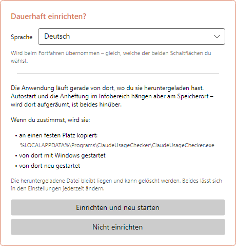
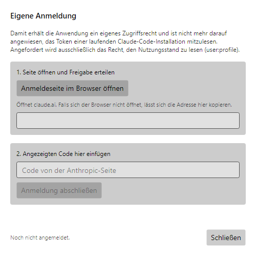
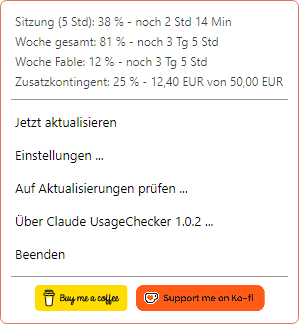
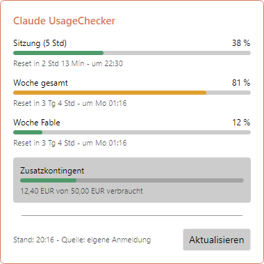
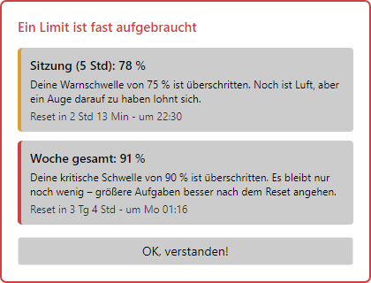
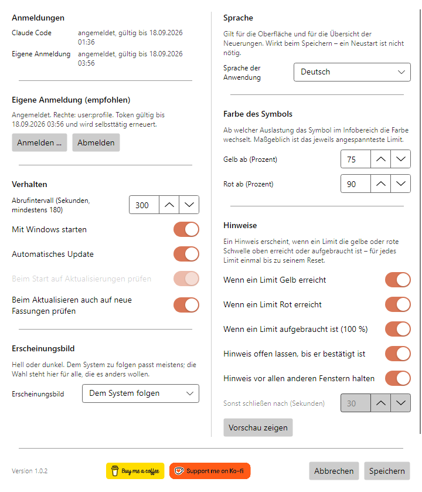
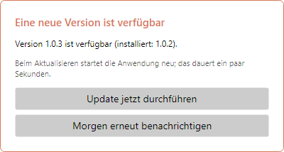
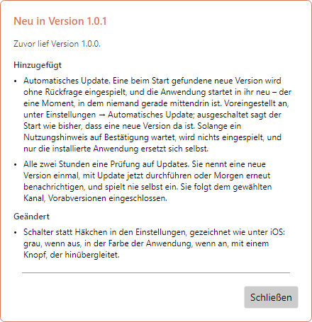
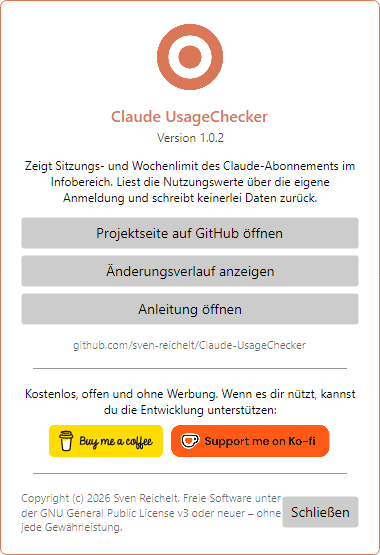

# Claude UsageChecker – Anleitung

[English](en.md) · **Deutsch** · [Español](es.md) · [Français](fr.md) · [Italiano](it.md) · [Português (Brasil)](pt-BR.md) · [Português (Portugal)](pt-PT.md) · [Русский](ru.md) · [简体中文](zh-Hans.md)

Claude UsageChecker zeigt dauerhaft im Windows-Infobereich oder in der
macOS-Menüleiste, wie viel vom Claude-Abonnement verbraucht ist: das
Fünf-Stunden-Sitzungslimit und die Wochenlimits. Diese Anleitung geht alles
durch, Fenster für Fenster.

Die Bilder zeigen Windows. Unter macOS sehen die Fenster genauso aus, nur das
Menü in der Menüleiste zeichnet das System selbst.

## Inhalt

1. [Installieren](#1-installieren)
2. [Der erste Start](#2-der-erste-start)
3. [Anmelden](#3-anmelden)
4. [Das Symbol](#4-das-symbol)
5. [Das Menü](#5-das-menü)
6. [Das Detailfenster](#6-das-detailfenster)
7. [Hinweise](#7-hinweise)
8. [Einstellungen](#8-einstellungen)
9. [Aktualisierungen](#9-aktualisierungen)
10. [Über das Projekt und Unterstützung](#10-über-das-projekt-und-unterstützung)
11. [Deinstallieren](#11-deinstallieren)
12. [Wenn etwas nicht funktioniert](#12-wenn-etwas-nicht-funktioniert)

## 1. Installieren

Die neueste Fassung liegt auf der
[Release-Seite](https://github.com/sven-reichelt/Claude-UsageChecker/releases/latest).
Mehr wird nicht gebraucht – keine .NET-Laufzeit, kein Installationsprogramm.

**Windows 10 oder 11:** `ClaudeUsageChecker.exe` herunterladen und starten. Weil
die Datei nicht signiert ist, meldet Windows SmartScreen beim ersten Mal einen
unbekannten Herausgeber. Auf **Weitere Informationen** klicken, dann auf
**Trotzdem ausführen**.

**macOS 12 oder neuer, Apple Silicon:** `ClaudeUsageChecker-macos-arm64.dmg`
herunterladen, öffnen und die Anwendung darin doppelklicken. macOS fragt einmal,
ob ein aus dem Internet geladenes Programm geöffnet werden soll; auf **Öffnen**
klicken. Nicht das `.zip` verwenden – das ist nur für die Selbstaktualisierung da.

## 2. Der erste Start

Beim ersten Start bietet die Anwendung an, sich dauerhaft einzurichten:

* unter **Windows** kopiert sie sich nach
  `%LOCALAPPDATA%\Programs\ClaudeUsageChecker`, startet von dort mit Windows und
  startet neu;
* unter **macOS** zieht sie in den Programme-Ordner, startet von dort bei der
  Anmeldung, startet neu und wirft das Disk-Image aus.

Oben zuerst die **Sprache** wählen – das Fenster wechselt sofort, und die Wahl
bleibt, welche der beiden Schaltflächen du auch drückst. **Einrichten und neu
starten** ist empfohlen: Autostart und Selbstaktualisierung funktionieren nur vom
festen Platz aus. **Nicht einrichten** lässt alles, wo es ist; den Autostart
kannst du später in den Einstellungen einschalten.

## 3. Anmelden

Die Anwendung braucht das Recht, deinen Nutzungsstand zu lesen. Dafür gibt es
zwei Wege, und sie probiert beide:

* **Eigene Anmeldung (empfohlen).** Unabhängig von Claude Code, und sie hält sich
  selbst gültig.
* **Das Token von Claude Code.** Ist Claude Code auf demselben Rechner installiert
  und angemeldet, liest die Anwendung dessen Token – nur lesend, es wird nie etwas
  zurückgeschrieben.

Zum Anmelden die **Einstellungen** öffnen und auf **Anmelden …** klicken:

1. Auf **Anmeldeseite im Browser öffnen** klicken. claude.ai öffnet sich, dort die
   Freigabe erteilen.
2. Die Seite zeigt einen Code. Den kopieren, in das Feld einfügen und auf
   **Anmeldung abschließen** klicken.

Angefordert wird ausschließlich das Recht, den Nutzungsstand zu lesen
(`user:profile`) – nicht, Anfragen in deinem Namen zu stellen, und nicht,
API-Schlüssel anzulegen. Die Anmeldung liegt verschlüsselt in der
Windows-Anmeldeinformationsverwaltung oder im macOS-Schlüsselbund.

## 4. Das Symbol

Das Symbol im Infobereich oder in der Menüleiste zeigt auf einen Blick, wie viel
verbraucht ist. Maßgeblich ist das jeweils angespannteste Limit:

| Symbol | Bedeutung |
| --- | --- |
|  | Alles im Rahmen |
|  | Ein Limit hat die gelbe Schwelle erreicht (voreingestellt 75 %) |
|  | Ein Limit hat die rote Schwelle erreicht (voreingestellt 90 %) |
|  | Nicht angemeldet oder keine Verbindung |

Unter **Windows** zeigt ein Zeiger auf das Symbol Sitzung und Wochenlimit samt
Rücksetzzeit. Ein Linksklick öffnet das [Detailfenster](#6-das-detailfenster), ein
Rechtsklick das [Menü](#5-das-menü).

> **Tipp für Windows:** Neue Symbole landen im Überlaufbereich hinter dem kleinen
> Pfeil. Zieh das Symbol auf die Taskleiste, damit es sichtbar bleibt.

Unter **macOS** öffnet ein Klick auf das Symbol das Menü.

## 5. Das Menü

Oben listet das Menü **alle Limits** auf, die für dein Abonnement gemeldet werden,
mit der Restzeit bis zum Reset – auch die modellbezogenen Wochenlimits und das
Zusatzkontingent, sofern aktiviert. Darunter:

* **Jetzt aktualisieren** – holt die Werte sofort, statt auf den nächsten Abruf zu
  warten.
* **Einstellungen …** – siehe [Einstellungen](#8-einstellungen).
* **Auf Aktualisierungen prüfen …** – sucht jetzt nach einer neuen Fassung.
* **Über Claude UsageChecker …** – zeigt Version, Änderungsverlauf und diese
  Anleitung.
* **Beenden** – beendet die Anwendung.

Unter macOS steht dort zusätzlich **Details anzeigen …**, und die beiden
Unterstützen-Buttons erscheinen als Einträge **Einen Kaffee spendieren …** und
**Auf Ko-fi unterstützen …**.

## 6. Das Detailfenster

Jedes Limit mit Balken, Prozentwert, Restzeit und Rücksetzzeitpunkt:

* **Sitzung (5 Std)** – das gleitende Fünf-Stunden-Limit.
* **Woche gesamt** – das Sieben-Tage-Limit über alle Modelle.
* **Woche** mit einem Modellnamen – ein Limit für ein einzelnes Modell. Es
  erscheint erst, wenn dieses Modell in der laufenden Woche genutzt wurde.
* **Zusatzkontingent** – der verbrauchte Betrag vom Monatslimit, in der Währung
  deines Kontos, sofern das Zusatzkontingent eingeschaltet ist.

Die Balken nehmen die Farben deiner Schwellen: grün unterhalb von Gelb, dann Gelb,
dann Rot. Unten steht, wann die Werte geholt wurden und woher das Zugriffsrecht
stammt. **Aktualisieren** holt sie neu. Das Fenster schließt sich, wenn du
woandershin klickst oder Escape drückst.

## 7. Hinweise

Ein Symbol übersieht man leicht, darum öffnet sich ein Hinweis, wenn ein Limit
**Gelb**, **Rot** oder **100 %** erreicht. Er nennt das Limit, wie weit es ist, was
das bedeutet und wann es zurückgesetzt wird.

* Jede Stufe wird **je Limit einmal** gemeldet, bis das Limit zurückgesetzt wird –
  und über einen Neustart hinweg gemerkt.
* Mehrere Limits zugleich teilen sich einen Hinweis.
* Voreingestellt bleibt der Hinweis vorne, bis du auf **OK, verstanden!** klickst.
* Er nimmt nicht die Tastatur: Was du gerade tippst, läuft weiter.
* Ein Hinweis zu einem inzwischen zurückgesetzten Limit schließt sich von selbst.

Wie nachdrücklich er ist, entscheidest du in den [Einstellungen](#hinweise).

## 8. Einstellungen

Änderungen wirken beim Klick auf **Speichern**; **Abbrechen** verwirft sie.

### Anmeldungen

Ganz oben: ob Claude Code auf diesem Rechner angemeldet ist und ob die eigene
Anmeldung funktioniert – immer beide, gleich welche gerade benutzt wird. Darunter
**Anmelden …** und **Abmelden** für die eigene Anmeldung.

### Verhalten

* **Abrufintervall** – wie oft die Werte geholt werden, in Sekunden. Mindestens
  180: Der Dienst drosselt alles Schnellere.
* **Mit Windows starten** bzw. **Bei der Anmeldung starten** – startet die
  Anwendung, sobald du dich am Rechner anmeldest. Fehlt der Eintrag einmal, setzt
  die Anwendung ihn beim nächsten Start wieder.
* **Automatisches Update** – spielt eine neue Version beim Start ohne Rückfrage
  ein. Siehe [Aktualisierungen](#9-aktualisierungen).
* **Beim Start auf Aktualisierungen prüfen** – nur verfügbar, wenn das
  automatische Update aus ist: Der Start sagt dann, dass eine neue Version da ist.
* **Beim Aktualisieren auch auf neue Fassungen prüfen** – die Schaltfläche
  **Aktualisieren** im Detailfenster sucht dann auch nach einer neuen Version.

### Erscheinungsbild

Hell, dunkel oder dem System folgen. Das Fenster wechselt schon beim Auswählen, du
kannst es also vor dem Speichern ansehen.

### Sprache

Die Sprache der ganzen Anwendung, samt der Übersicht der Neuerungen nach einem
Update. Wirkt beim Speichern, ohne Neustart.

### Farbe des Symbols

Ab welcher Auslastung Symbol, Balken und Hinweise **gelb** und **rot** werden.
Gelb muss unter Rot liegen.

### Hinweise

* Zu welchen Stufen ein Hinweis kommt: **Gelb**, **Rot**, **aufgebraucht (100 %)**.
* **Hinweis offen lassen, bis er bestätigt ist** – sonst schließt er sich nach der
  Anzahl Sekunden darunter von selbst.
* **Hinweis vor allen anderen Fenstern halten**.
* **Vorschau zeigen** – zeigt einen Hinweis mit Beispielwerten, damit du siehst,
  was die Einstellungen darüber bewirken.

Unten im Fenster stehen die Versionsnummer und die
[Unterstützen-Buttons](#10-über-das-projekt-und-unterstützung).

## 9. Aktualisierungen

Die Anwendung hält sich selbst aktuell. Jede geladene Datei wird gegen die
veröffentlichte SHA-256-Prüfsumme geprüft, bevor irgendetwas ausgeführt wird –
unter macOS zusätzlich gegen die Signatur.

**Mit eingeschaltetem automatischem Update** (Vorgabe) wird eine beim Start
gefundene neue Version ohne Rückfrage eingespielt. Die Anwendung startet innerhalb
weniger Sekunden neu und zeigt, was neu ist.

**Mit ausgeschaltetem automatischem Update** sagt der Start, dass eine neue Version
da ist, und das Einspielen bleibt ein Klick auf **Jetzt einspielen und neu
starten**.

**In beiden Fällen** prüft die Anwendung alle zwei Stunden im Hintergrund. Findet
sie eine neue Version, fragt sie **einmal**:

* **Update jetzt durchführen** – spielt es ein und startet neu.
* **Morgen erneut benachrichtigen** – fragt in 24 Stunden wieder. Wird der Rechner
  zwischendurch neu gestartet, kommt das Update beim Start, sofern das automatische
  Update an ist.

Solange ein Nutzungshinweis auf Bestätigung wartet, wird nichts eingespielt.

Nach einem Update zeigt die Anwendung, was sich seit deiner vorherigen Fassung
geändert hat – auch über mehrere Versionen hinweg, wenn du welche übersprungen
hast.

## 10. Über das Projekt und Unterstützung

**Über Claude UsageChecker** im Menü zeigt die Version und führt zur Projektseite,
zum vollständigen Änderungsverlauf und zu dieser Anleitung.

Claude UsageChecker ist kostenlos, offen und ohne Werbung. Wenn es dir nützt,
führen die Buttons **Buy me a coffee** und **Support me on Ko-fi** – hier, im Menü
und unten in den Einstellungen – zu den Seiten, auf denen du die Entwicklung
unterstützen kannst. Ein Klick öffnet nur die Seite im Browser.

## 11. Deinstallieren

**Windows**

1. Rechtsklick auf das Symbol, **Beenden**.
2. Wer den Autostart sauber entfernen will, öffnet vorher die Einstellungen,
   schaltet **Mit Windows starten** aus und speichert – oder löscht den Wert
   `ClaudeUsageChecker` unter
   `HKEY_CURRENT_USER\Software\Microsoft\Windows\CurrentVersion\Run`.
3. Die Ordner `%LOCALAPPDATA%\Programs\ClaudeUsageChecker` (die Anwendung) und
   `%LOCALAPPDATA%\ClaudeUsageChecker` (Einstellungen) löschen.
4. In der Anmeldeinformationsverwaltung die Einträge entfernen, die mit
   `ClaudeUsageChecker:` beginnen.

**macOS**

1. Im Menü **Beenden** wählen.
2. `/Applications/ClaudeUsageChecker.app`,
   `~/Library/Application Support/ClaudeUsageChecker` und
   `~/Library/LaunchAgents/de.sven-reichelt.claudeusagechecker.plist` löschen.
3. In der Schlüsselbundverwaltung die Einträge entfernen, die mit
   `ClaudeUsageChecker:` beginnen.

Die vollständige Liste, was wo abgelegt wird, steht in
[SECURITY.md](../de/SECURITY.md#2a-was-die-anwendung-wo-ablegt--vollständig).

## 12. Wenn etwas nicht funktioniert

**Das Symbol bleibt grau.** Die Anwendung hat kein Zugriffsrecht. Öffne die
Einstellungen: Mindestens eine der beiden Anmeldungen muss *angemeldet* zeigen.
Wenn nicht, neu anmelden.

**„Deine eigene Anmeldung ist abgelaufen".** Wie lange eine Anmeldung ohne Nutzung
hält, dokumentiert Anthropic nicht. Melde dich unter **Einstellungen → Anmelden …**
neu an; bis dahin wird das Token von Claude Code benutzt, falls vorhanden.

**Keine Werte, „die API drosselt Anfragen".** Der Dienst begrenzt, wie oft er
gefragt werden darf. Die Anwendung wartet von selbst und versucht es erneut; ein
kürzeres Abrufintervall macht es schlimmer, nicht besser.

**Ein Hinweis erscheint nicht.** Jede Stufe wird je Limit einmal gemeldet, bis es
zurückgesetzt wird. Prüfe unter **Einstellungen → Hinweise**, ob die Stufe
eingeschaltet ist, und probiere **Vorschau zeigen**.

**Windows warnt vor einem unbekannten Herausgeber.** Das ist erwartet: Die Datei
ist nicht signiert. **Weitere Informationen → Trotzdem ausführen**.

**macOS weigert sich, die Anwendung zu öffnen.** Nimm das `.dmg`, nicht das `.zip`.
Kommt die Weigerung direkt nach der Veröffentlichung einer neuen Version, versuch
es etwas später noch einmal.

**Etwas anderes.** Die Anwendung schreibt ein `crash.log` neben ihre Einstellungen
– unter Windows `%LOCALAPPDATA%\ClaudeUsageChecker\crash.log`, unter macOS
`~/Library/Application Support/ClaudeUsageChecker/crash.log`. Es enthält keine
Tokens. Bitte
[melde das Problem](https://github.com/sven-reichelt/Claude-UsageChecker/issues/new/choose)
und häng es an – aber füge niemals ein Zugriffstoken ein.
