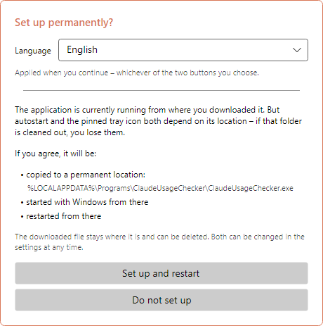
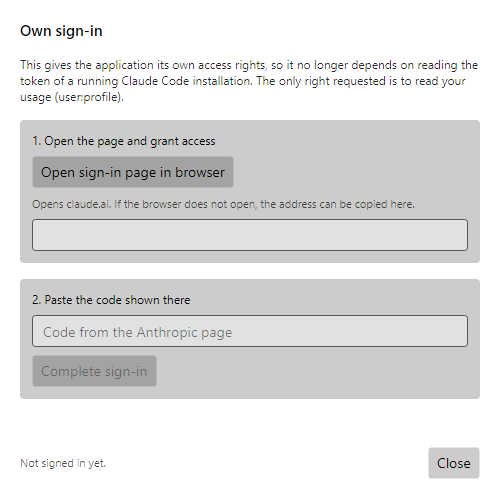
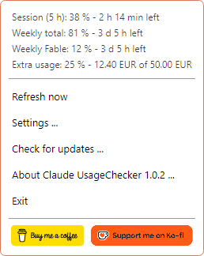
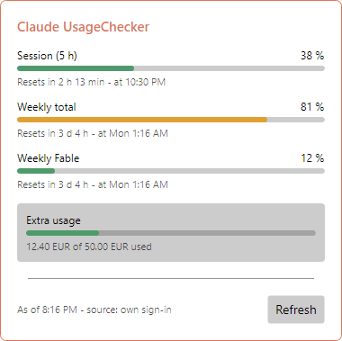
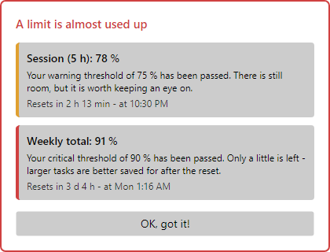
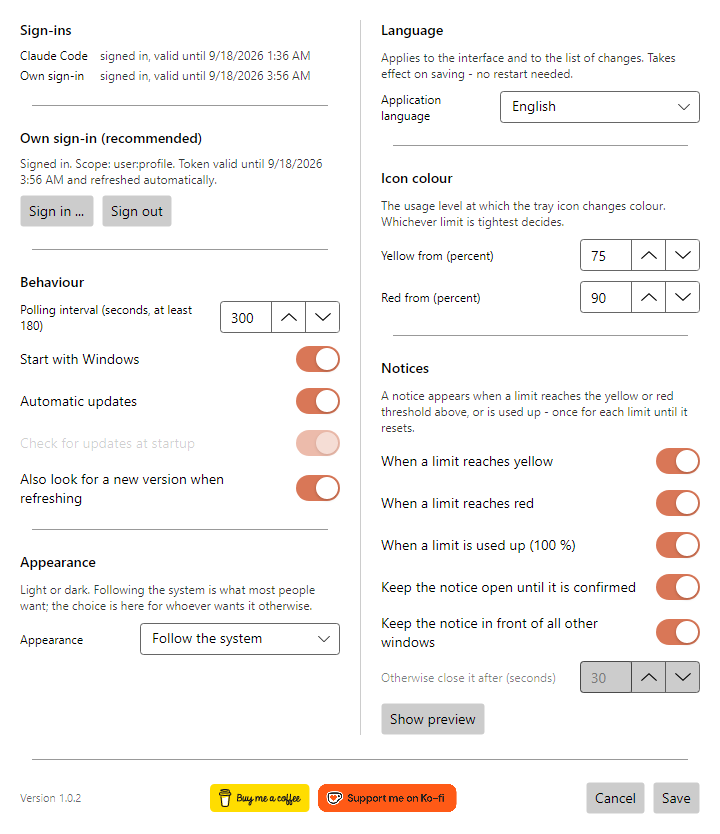
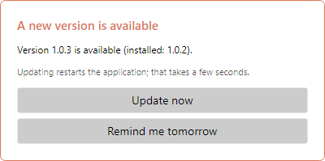
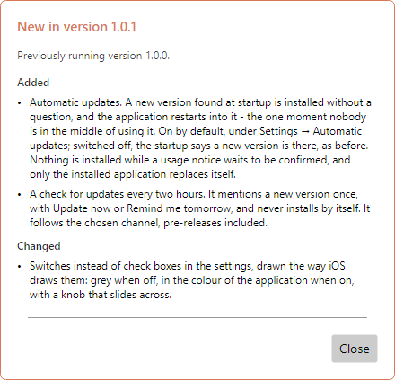
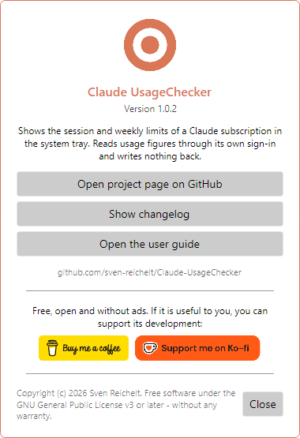

# Claude UsageChecker – User guide

**English** · [Deutsch](de.md) · [Español](es.md) · [Français](fr.md) · [Italiano](it.md) · [Português (Brasil)](pt-BR.md) · [Português (Portugal)](pt-PT.md) · [Русский](ru.md) · [简体中文](zh-Hans.md)

Claude UsageChecker shows how much of your Claude subscription you have used -
the five-hour session limit and the weekly limits - permanently in the Windows
notification area or the macOS menu bar. This guide walks through everything the
application does, window by window.

The pictures show Windows. On macOS the windows look the same; only the menu in
the menu bar is drawn by the system.

## Contents

1. [Installing](#1-installing)
2. [The first start](#2-the-first-start)
3. [Signing in](#3-signing-in)
4. [The icon](#4-the-icon)
5. [The menu](#5-the-menu)
6. [The details window](#6-the-details-window)
7. [Notices](#7-notices)
8. [Settings](#8-settings)
9. [Updates](#9-updates)
10. [About, and supporting the project](#10-about-and-supporting-the-project)
11. [Uninstalling](#11-uninstalling)
12. [When something does not work](#12-when-something-does-not-work)

## 1. Installing

Download the latest version from the
[release page](https://github.com/sven-reichelt/Claude-UsageChecker/releases/latest).
Nothing else is needed - no .NET runtime, no installer.

**Windows 10 or 11:** download `ClaudeUsageChecker.exe` and start it. Because the
file is not signed, Windows SmartScreen reports an unknown publisher the first
time. Click **More info**, then **Run anyway**.

**macOS 12 or later, Apple silicon:** download `ClaudeUsageChecker-macos-arm64.dmg`,
open it and double-click the application inside. macOS asks once whether you want
to open an application downloaded from the internet; click **Open**. Do not use
the `.zip` - it exists only for the application's own updates.

## 2. The first start

On the first start the application offers to set itself up permanently:

* on **Windows** it copies itself to `%LOCALAPPDATA%\Programs\ClaudeUsageChecker`,
  starts with Windows from there and restarts;
* on **macOS** it moves into the Applications folder, starts at login from there,
  restarts and ejects the disk image.

Choose your **language** at the top first - the window switches at once, and the
choice is kept whichever button you press. **Set up and restart** is recommended:
autostart and updating itself only work from the permanent location. **Do not set
up** leaves everything where it is; you can still switch autostart on later in
the settings.

## 3. Signing in

The application needs permission to read your usage. There are two ways, and it
tries both:

* **Its own sign-in (recommended).** Independent of Claude Code, and it keeps
  itself valid.
* **The token of Claude Code.** If Claude Code is installed and signed in on the
  same machine, the application reads its token - read only, nothing is ever
  written back.

To sign in, open **Settings** and click **Sign in …**:

1. Click **Open sign-in page in browser**. claude.ai opens; approve the access
   there.
2. The page shows a code. Copy it, paste it into the field and click **Complete
   sign-in**.

The only permission requested is to read your usage (`user:profile`) - not to
send requests on your behalf, and not to create API keys. The sign-in is stored
encrypted in the Windows Credential Manager or the macOS keychain.

## 4. The icon

The icon in the notification area or menu bar shows at a glance how much is used.
Whichever limit is tightest decides:

| Icon | Meaning |
| --- | --- |
|  | Everything within bounds |
|  | A limit has reached the yellow threshold (75 % by default) |
|  | A limit has reached the red threshold (90 % by default) |
|  | Not signed in, or no connection |

On **Windows**, pointing at the icon shows session and weekly limit with their
reset time. A left click opens the [details window](#6-the-details-window), a
right click the [menu](#5-the-menu).

> **Tip for Windows:** new icons land in the overflow area behind the small arrow.
> Drag the icon onto the taskbar to keep it in view.

On **macOS** a click on the icon opens the menu.

## 5. The menu

At the top the menu lists **every limit** reported for your subscription, with the
time left until it resets - including the model-specific weekly limits and the
extra usage, where enabled. Below:

* **Refresh now** – fetches the figures at once instead of waiting for the next
  call.
* **Settings …** – see [Settings](#8-settings).
* **Check for updates …** – looks for a new version now.
* **About Claude UsageChecker …** – shows the version, the changelog and this
  guide.
* **Exit** – ends the application.

On macOS the menu also has **Show details …**, and the two support buttons appear
as the entries **Buy me a coffee …** and **Support on Ko-fi …**.

## 6. The details window

Each limit with a bar, its percentage, the time left and the moment it resets:

* **Session (5 h)** – the rolling five-hour limit.
* **Weekly total** – the seven-day limit across all models.
* **Weekly** followed by a model name – a limit for one model. It appears only
  once that model has been used in the current week.
* **Extra usage** – the amount spent from the monthly cap, in the currency of your
  account, where extra usage is switched on.

The bars take their colours from your thresholds: green below yellow, then yellow,
then red. The foot says when the figures were fetched and where the access came
from. **Refresh** fetches them anew. The window closes when you click elsewhere or
press Escape.

## 7. Notices

An icon is easy to miss, so a notice opens when a limit reaches **yellow**,
**red** or **100 %**. It names the limit, how far it has come, what that means,
and when it resets.

* Each stage is announced **once per limit** until that limit resets - and
  remembered across a restart.
* Several limits at once share one notice.
* By default the notice stays in front until you click **OK, got it!**.
* It does not take the keyboard: whatever you are typing carries on.
* A notice about a limit that has since reset closes by itself.

How insistent it is, you decide in the [settings](#notices).

## 8. Settings

Changes take effect when you click **Save**; **Cancel** discards them.

### Sign-ins

At the top: whether Claude Code is signed in on this machine, and whether the
application's own sign-in works - always both, whichever is in use. Below it,
**Sign in …** and **Sign out** for the application's own sign-in.

### Behaviour

* **Polling interval** – how often the figures are fetched, in seconds. At least
  180: the service throttles anything faster.
* **Start with Windows** / **Start at login** – starts the application when you
  sign in to your computer. If the entry ever goes missing, the application puts
  it back at its next start.
* **Automatic updates** – installs a new version at startup, without asking. See
  [Updates](#9-updates).
* **Check for updates at startup** – only available with automatic updates off:
  the startup then says that a new version is there.
* **Also look for a new version when refreshing** – the **Refresh** button in the
  details window checks for updates as well.

### Appearance

Light, dark, or following the system. The window changes as soon as you choose, so
you can try before saving.

### Language

The language of the whole application, including the list of changes after an
update. Takes effect on saving; no restart.

### Icon colour

The usage at which the icon, the bars and the notices turn **yellow** and **red**.
Yellow has to be below red.

### Notices

* Which stages bring a notice: **yellow**, **red**, **used up (100 %)**.
* **Keep the notice open until it is confirmed** – otherwise it closes by itself
  after the number of seconds below.
* **Keep the notice in front of all other windows**.
* **Show preview** – shows a notice with example figures, so you can see what the
  choices above do.

At the foot of the window are the version number and the
[support buttons](#10-about-and-supporting-the-project).

## 9. Updates

The application keeps itself up to date. Every download is checked against the
published SHA-256 checksum before anything is run - and on macOS against the
signature as well.

**With automatic updates on** (the default), a new version found at startup is
installed without a question. The application restarts into it within a few
seconds and shows what is new.

**With automatic updates off**, the startup says that a new version is there, and
installing stays a click on **Install now and restart**.

**Either way**, the application checks every two hours in the background. When it
finds a new version, it asks **once**:

* **Update now** – installs it and restarts.
* **Remind me tomorrow** – asks again in 24 hours. If the computer is restarted in
  the meantime, the update is installed at startup where automatic updates are on.

Nothing is installed while a usage notice is waiting to be confirmed.

After an update the application shows what has changed since the version you had
before - across several versions if you skipped some.

## 10. About, and supporting the project

**About Claude UsageChecker** in the menu shows the version and links to the
project page, the complete changelog and this guide.

Claude UsageChecker is free, open and without ads. If it is useful to you, the
**Buy me a coffee** and **Support me on Ko-fi** buttons - here, in the menu and at
the foot of the settings - lead to the pages where you can support its
development. A click only opens the page in your browser.

## 11. Uninstalling

**Windows**

1. Right-click the icon and choose **Exit**.
2. Open the settings first if you want to remove autostart cleanly: switch off
   **Start with Windows** and save - or delete the value `ClaudeUsageChecker` under
   `HKEY_CURRENT_USER\Software\Microsoft\Windows\CurrentVersion\Run`.
3. Delete the folders `%LOCALAPPDATA%\Programs\ClaudeUsageChecker` (the
   application) and `%LOCALAPPDATA%\ClaudeUsageChecker` (settings).
4. In the Windows Credential Manager, remove the entries starting with
   `ClaudeUsageChecker:`.

**macOS**

1. Choose **Exit** in the menu.
2. Delete `/Applications/ClaudeUsageChecker.app`,
   `~/Library/Application Support/ClaudeUsageChecker` and
   `~/Library/LaunchAgents/de.sven-reichelt.claudeusagechecker.plist`.
3. In Keychain Access, remove the entries starting with `ClaudeUsageChecker:`.

The complete list of what is stored where is in
[SECURITY.md](../../SECURITY.md#2a-what-the-application-stores-where---in-full).

## 12. When something does not work

**The icon stays grey.** The application has no access. Open the settings: at
least one of the two sign-ins has to say *signed in*. If not, sign in again.

**"Your own sign-in has expired".** How long a sign-in lasts without use is not
documented by Anthropic. Sign in again under **Settings → Sign in …**; until then
the token of Claude Code is used, where there is one.

**No figures, "the API is throttling requests".** The service limits how often it
may be asked. The application waits by itself and tries again; a shorter polling
interval makes it worse, not better.

**A notice does not appear.** Each stage is announced once per limit until it
resets. Check under **Settings → Notices** that the stage is switched on, and try
**Show preview**.

**Windows warns about an unknown publisher.** Expected: the file is not signed.
**More info → Run anyway**.

**macOS refuses to open the application.** Use the `.dmg`, not the `.zip`. If it is
refused straight after a new version was published, try again a little later.

**Something else.** The application writes a `crash.log` beside its settings -
`%LOCALAPPDATA%\ClaudeUsageChecker\crash.log` on Windows,
`~/Library/Application Support/ClaudeUsageChecker/crash.log` on macOS. It contains
no tokens. Please
[report the problem](https://github.com/sven-reichelt/Claude-UsageChecker/issues/new/choose)
and attach it - but never paste an access token.
