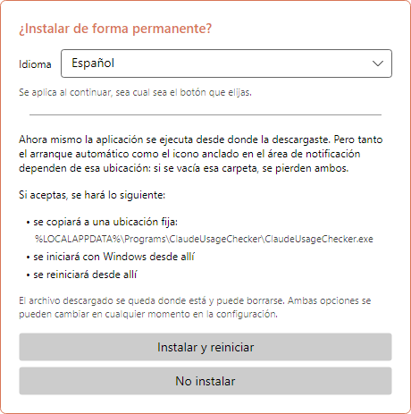
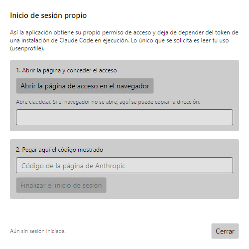
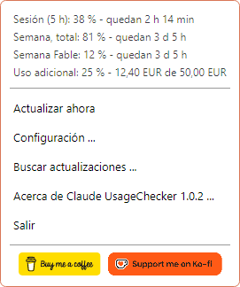
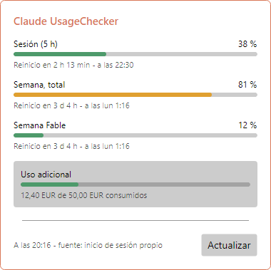
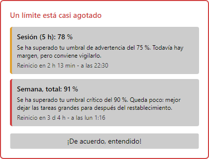
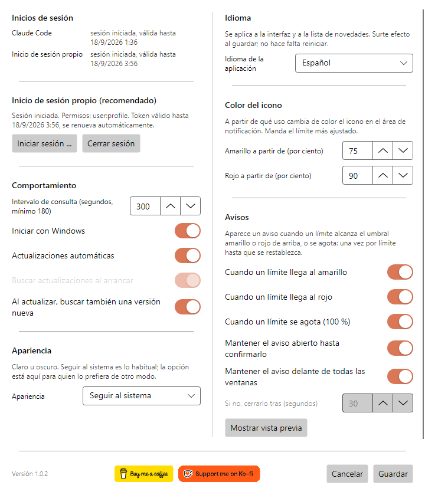
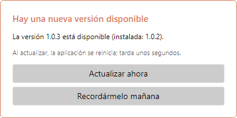
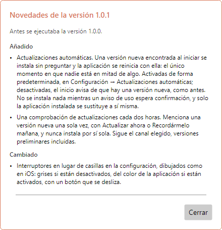
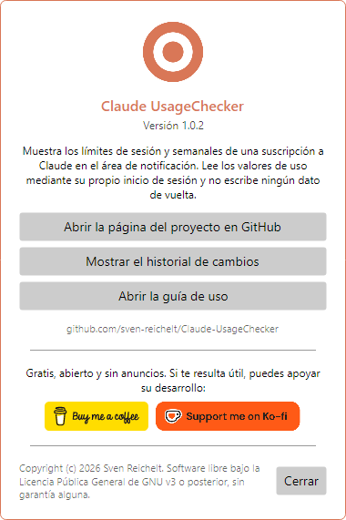

# Claude UsageChecker – Guía de uso

[English](en.md) · [Deutsch](de.md) · **Español** · [Français](fr.md) · [Italiano](it.md) · [Português (Brasil)](pt-BR.md) · [Português (Portugal)](pt-PT.md) · [Русский](ru.md) · [简体中文](zh-Hans.md)

Claude UsageChecker muestra de forma permanente, en el área de notificación de
Windows o en la barra de menús de macOS, cuánto has consumido de tu suscripción a
Claude: el límite de sesión de cinco horas y los límites semanales. Esta guía
recorre todo lo que hace la aplicación, ventana por ventana.

Las imágenes son de Windows. En macOS las ventanas se ven igual; solo el menú de
la barra lo dibuja el sistema.

## Contenido

1. [Instalación](#1-instalación)
2. [El primer inicio](#2-el-primer-inicio)
3. [Iniciar sesión](#3-iniciar-sesión)
4. [El icono](#4-el-icono)
5. [El menú](#5-el-menú)
6. [La ventana de detalles](#6-la-ventana-de-detalles)
7. [Avisos](#7-avisos)
8. [Configuración](#8-configuración)
9. [Actualizaciones](#9-actualizaciones)
10. [Acerca de y apoyo al proyecto](#10-acerca-de-y-apoyo-al-proyecto)
11. [Desinstalación](#11-desinstalación)
12. [Cuando algo no funciona](#12-cuando-algo-no-funciona)

## 1. Instalación

Descarga la última versión desde la
[página de versiones](https://github.com/sven-reichelt/Claude-UsageChecker/releases/latest).
No hace falta nada más: ni entorno .NET ni instalador.

**Windows 10 u 11:** descarga `ClaudeUsageChecker.exe` e inícialo. Como el archivo
no está firmado, Windows SmartScreen avisa la primera vez de un editor
desconocido. Pulsa **Más información** y luego **Ejecutar de todas formas**.

**macOS 12 o posterior, Apple silicon:** descarga
`ClaudeUsageChecker-macos-arm64.dmg`, ábrelo y haz doble clic en la aplicación que
contiene. macOS pregunta una vez si quieres abrir una aplicación descargada de
internet; pulsa **Abrir**. No uses el `.zip`: existe solo para que la aplicación se
actualice a sí misma.

## 2. El primer inicio

En el primer inicio la aplicación propone instalarse de forma permanente:

* en **Windows** se copia a `%LOCALAPPDATA%\Programs\ClaudeUsageChecker`, se inicia
  con Windows desde allí y se reinicia;
* en **macOS** se traslada a la carpeta Aplicaciones, se inicia al iniciar sesión
  desde allí, se reinicia y expulsa la imagen de disco.

Elige primero el **idioma** arriba: la ventana cambia al instante y la elección se
conserva pulses el botón que pulses. Se recomienda **Instalar y reiniciar**: el
inicio automático y la actualización automática solo funcionan desde la ubicación
permanente. **No instalar** lo deja todo donde está; el inicio automático puedes
activarlo más tarde en la configuración.

## 3. Iniciar sesión

La aplicación necesita permiso para leer tu uso. Hay dos caminos y prueba los dos:

* **Su propio inicio de sesión (recomendado).** Independiente de Claude Code, y se
  mantiene válido por sí mismo.
* **El token de Claude Code.** Si Claude Code está instalado y con la sesión
  iniciada en el mismo equipo, la aplicación lee su token: solo lectura, nunca
  escribe nada de vuelta.

Para iniciar sesión, abre **Configuración** y pulsa **Iniciar sesión …**:

1. Pulsa **Abrir la página de inicio de sesión en el navegador**. Se abre claude.ai;
   concede allí el acceso.
2. La página muestra un código. Cópialo, pégalo en el campo y pulsa **Completar el
   inicio de sesión**.

El único permiso que se solicita es leer tu uso (`user:profile`); no enviar
peticiones en tu nombre ni crear claves de API. La sesión se guarda cifrada en el
Administrador de credenciales de Windows o en el llavero de macOS.

## 4. El icono

El icono del área de notificación o de la barra de menús muestra de un vistazo
cuánto se ha consumido. Manda el límite más ajustado:

| Icono | Significado |
| --- | --- |
|  | Todo dentro de lo previsto |
|  | Un límite ha alcanzado el umbral amarillo (75 % por defecto) |
|  | Un límite ha alcanzado el umbral rojo (90 % por defecto) |
|  | Sin sesión iniciada o sin conexión |

En **Windows**, al apuntar al icono aparecen la sesión y el límite semanal con su
hora de restablecimiento. Un clic izquierdo abre la
[ventana de detalles](#6-la-ventana-de-detalles); uno derecho, el [menú](#5-el-menú).

> **Consejo para Windows:** los iconos nuevos van al área de desbordamiento, tras
> la flecha pequeña. Arrastra el icono a la barra de tareas para tenerlo a la vista.

En **macOS**, un clic en el icono abre el menú.

## 5. El menú

Arriba, el menú enumera **todos los límites** que informa tu suscripción, con el
tiempo que queda hasta su restablecimiento, incluidos los límites semanales por
modelo y el uso adicional, si está activado. Debajo:

* **Actualizar ahora**: obtiene las cifras al momento en lugar de esperar a la
  siguiente consulta.
* **Configuración …**: véase [Configuración](#8-configuración).
* **Buscar actualizaciones …**: busca ahora una versión nueva.
* **Acerca de Claude UsageChecker …**: muestra la versión, el registro de cambios y
  esta guía.
* **Salir**: cierra la aplicación.

En macOS el menú incluye además **Mostrar detalles …**, y los dos botones de apoyo
aparecen como entradas de texto.

## 6. La ventana de detalles

Cada límite con su barra, su porcentaje, el tiempo restante y el momento en que se
restablece:

* **Sesión (5 h)**: el límite móvil de cinco horas.
* **Semana, total**: el límite de siete días para todos los modelos.
* **Semana** seguido del nombre de un modelo: un límite para ese modelo. Aparece
  solo cuando ese modelo se ha usado en la semana en curso.
* **Uso adicional**: el importe consumido del tope mensual, en la moneda de tu
  cuenta, si el uso adicional está activado.

Las barras toman el color de tus umbrales: verde por debajo del amarillo, luego
amarillo y luego rojo. Al pie se indica cuándo se obtuvieron las cifras y de dónde
viene el acceso. **Actualizar** las vuelve a pedir. La ventana se cierra al hacer
clic en otro sitio o al pulsar Escape.

## 7. Avisos

Un icono pasa desapercibido con facilidad, así que aparece un aviso cuando un
límite llega al **amarillo**, al **rojo** o al **100 %**. Indica el límite, hasta
dónde ha llegado, qué significa y cuándo se restablece.

* Cada nivel se anuncia **una vez por límite** hasta que ese límite se restablece,
  y se recuerda tras un reinicio.
* Varios límites a la vez comparten un mismo aviso.
* De forma predeterminada el aviso permanece delante hasta que pulsas **¡De
  acuerdo, entendido!**.
* No se apropia del teclado: lo que estés escribiendo sigue su curso.
* Un aviso sobre un límite ya restablecido se cierra solo.

Lo insistente que sea lo decides en la [configuración](#avisos).

## 8. Configuración

Los cambios se aplican al pulsar **Guardar**; **Cancelar** los descarta.

### Inicios de sesión

Arriba: si Claude Code tiene la sesión iniciada en este equipo y si funciona el
inicio de sesión propio de la aplicación; siempre ambos, se use el que se use.
Debajo, **Iniciar sesión …** y **Cerrar sesión** para el inicio propio.

### Comportamiento

* **Intervalo de consulta**: cada cuánto se obtienen las cifras, en segundos.
  Mínimo 180: el servicio limita cualquier ritmo mayor.
* **Iniciar con Windows** / **Iniciar al iniciar sesión**: arranca la aplicación
  cuando entras en tu equipo. Si la entrada llegara a faltar, la aplicación la
  restablece en su siguiente arranque.
* **Actualizaciones automáticas**: instala una versión nueva al iniciar, sin
  preguntar. Véase [Actualizaciones](#9-actualizaciones).
* **Buscar actualizaciones al iniciar**: disponible solo con las actualizaciones
  automáticas desactivadas; el inicio avisa entonces de que hay una versión nueva.
* **Buscar también una versión nueva al actualizar**: el botón **Actualizar** de la
  ventana de detalles busca además actualizaciones.

### Apariencia

Clara, oscura o siguiendo al sistema. La ventana cambia ya al elegir, de modo que
puedes verlo antes de guardar.

### Idioma

El idioma de toda la aplicación, incluida la lista de novedades tras una
actualización. Se aplica al guardar, sin reiniciar.

### Color del icono

A partir de qué uso el icono, las barras y los avisos pasan a **amarillo** y a
**rojo**. El amarillo debe quedar por debajo del rojo.

### Avisos

* Con qué niveles llega un aviso: **amarillo**, **rojo**, **agotado (100 %)**.
* **Mantener el aviso abierto hasta confirmarlo**; si no, se cierra solo tras los
  segundos indicados debajo.
* **Mantener el aviso delante de todas las ventanas**.
* **Mostrar vista previa**: muestra un aviso con cifras de ejemplo para ver qué
  hacen las opciones anteriores.

Al pie de la ventana están el número de versión y los
[botones de apoyo](#10-acerca-de-y-apoyo-al-proyecto).

## 9. Actualizaciones

La aplicación se mantiene al día por sí misma. Cada descarga se comprueba contra la
suma SHA-256 publicada antes de ejecutar nada, y en macOS también contra la firma.

**Con las actualizaciones automáticas activadas** (lo predeterminado), una versión
nueva encontrada al iniciar se instala sin preguntar. La aplicación se reinicia con
ella en unos segundos y muestra las novedades.

**Con las actualizaciones automáticas desactivadas**, el inicio avisa de que hay una
versión nueva y la instalación sigue siendo un clic en **Instalar ahora y
reiniciar**.

**En ambos casos** la aplicación comprueba cada dos horas en segundo plano. Cuando
encuentra una versión nueva, pregunta **una vez**:

* **Actualizar ahora**: la instala y reinicia.
* **Recordármelo mañana**: vuelve a preguntar en 24 horas. Si el equipo se reinicia
  entretanto, la actualización se instala al arrancar si las automáticas están
  activadas.

Mientras un aviso de uso espera confirmación, no se instala nada.

Tras una actualización la aplicación muestra qué ha cambiado desde tu versión
anterior, incluso a través de varias versiones si te saltaste alguna.

## 10. Acerca de y apoyo al proyecto

**Acerca de Claude UsageChecker**, en el menú, muestra la versión y lleva a la
página del proyecto, al registro de cambios completo y a esta guía.

Claude UsageChecker es gratuito, abierto y sin anuncios. Si te resulta útil, los
botones **Buy me a coffee** y **Support me on Ko-fi** —aquí, en el menú y al pie de
la configuración— llevan a las páginas donde puedes apoyar su desarrollo. Un clic
solo abre la página en tu navegador.

## 11. Desinstalación

**Windows**

1. Haz clic derecho en el icono y elige **Salir**.
2. Para quitar limpiamente el inicio automático, abre antes la configuración,
   desactiva **Iniciar con Windows** y guarda; o borra el valor
   `ClaudeUsageChecker` en
   `HKEY_CURRENT_USER\Software\Microsoft\Windows\CurrentVersion\Run`.
3. Borra las carpetas `%LOCALAPPDATA%\Programs\ClaudeUsageChecker` (la aplicación)
   y `%LOCALAPPDATA%\ClaudeUsageChecker` (la configuración).
4. En el Administrador de credenciales de Windows, elimina las entradas que
   empiezan por `ClaudeUsageChecker:`.

**macOS**

1. Elige **Salir** en el menú.
2. Borra `/Applications/ClaudeUsageChecker.app`,
   `~/Library/Application Support/ClaudeUsageChecker` y
   `~/Library/LaunchAgents/de.sven-reichelt.claudeusagechecker.plist`.
3. En Acceso a Llaveros, elimina las entradas que empiezan por
   `ClaudeUsageChecker:`.

La lista completa de qué se guarda y dónde está en
[SECURITY.md](../../SECURITY.md#2a-what-the-application-stores-where---in-full).

## 12. Cuando algo no funciona

**El icono sigue gris.** La aplicación no tiene acceso. Abre la configuración: al
menos uno de los dos inicios de sesión debe indicar *sesión iniciada*. Si no,
vuelve a iniciar sesión.

**«Tu inicio de sesión ha caducado».** Anthropic no documenta cuánto dura una
sesión sin uso. Vuelve a iniciarla en **Configuración → Iniciar sesión …**; hasta
entonces se usa el token de Claude Code, si lo hay.

**Sin cifras, «la API está limitando las peticiones».** El servicio limita con qué
frecuencia se le puede preguntar. La aplicación espera sola y vuelve a intentarlo;
un intervalo más corto empeora las cosas, no las mejora.

**Un aviso no aparece.** Cada nivel se anuncia una vez por límite hasta que este se
restablece. Comprueba en **Configuración → Avisos** que el nivel esté activado y
prueba **Mostrar vista previa**.

**Windows avisa de un editor desconocido.** Es lo esperado: el archivo no está
firmado. **Más información → Ejecutar de todas formas**.

**macOS se niega a abrir la aplicación.** Usa el `.dmg`, no el `.zip`. Si la
negativa llega justo después de publicarse una versión nueva, inténtalo un poco más
tarde.

**Otra cosa.** La aplicación escribe un `crash.log` junto a su configuración:
`%LOCALAPPDATA%\ClaudeUsageChecker\crash.log` en Windows y
`~/Library/Application Support/ClaudeUsageChecker/crash.log` en macOS. No contiene
tokens. Por favor,
[informa del problema](https://github.com/sven-reichelt/Claude-UsageChecker/issues/new/choose)
y adjúntalo, pero no pegues nunca un token de acceso.
