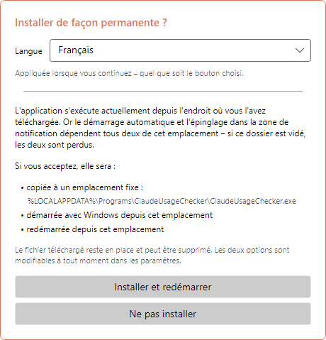
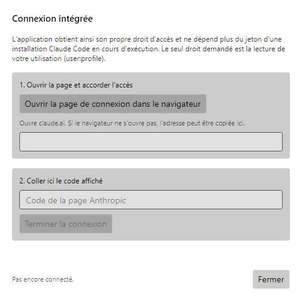
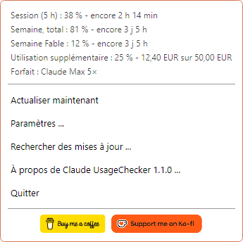
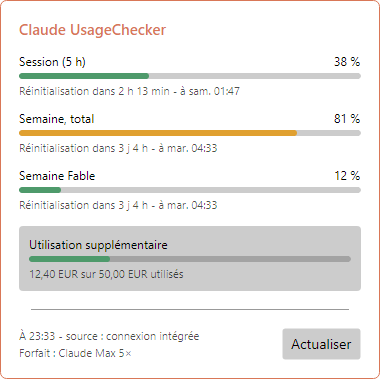
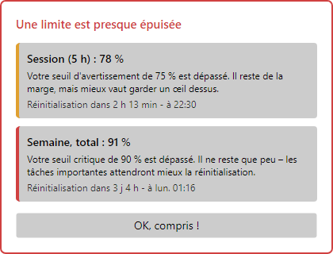
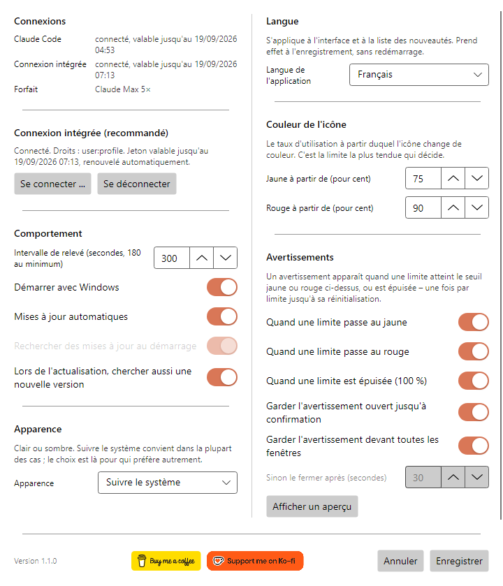
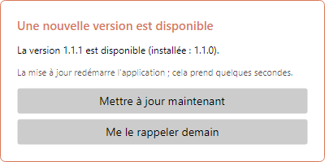
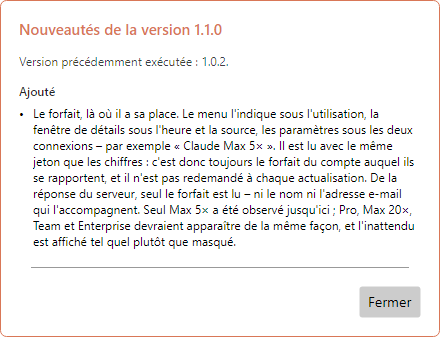
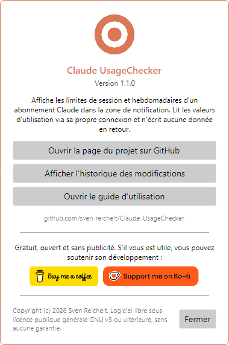

# Claude UsageChecker – Guide d'utilisation

[English](en.md) · [Deutsch](de.md) · [Español](es.md) · **Français** · [Italiano](it.md) · [Português (Brasil)](pt-BR.md) · [Português (Portugal)](pt-PT.md) · [Русский](ru.md) · [简体中文](zh-Hans.md)

Claude UsageChecker affiche en permanence, dans la zone de notification de Windows
ou dans la barre des menus de macOS, ce que vous avez consommé de votre abonnement
Claude : la limite de session de cinq heures et les limites hebdomadaires. Ce guide
parcourt tout ce que fait l'application, fenêtre par fenêtre.

Les images montrent Windows. Sous macOS les fenêtres sont identiques ; seul le menu
de la barre est dessiné par le système.

## Sommaire

1. [Installation](#1-installation)
2. [Le premier démarrage](#2-le-premier-démarrage)
3. [Se connecter](#3-se-connecter)
4. [L'icône](#4-licône)
5. [Le menu](#5-le-menu)
6. [La fenêtre de détails](#6-la-fenêtre-de-détails)
7. [Avertissements](#7-avertissements)
8. [Paramètres](#8-paramètres)
9. [Mises à jour](#9-mises-à-jour)
10. [À propos et soutien au projet](#10-à-propos-et-soutien-au-projet)
11. [Désinstallation](#11-désinstallation)
12. [Quand quelque chose ne marche pas](#12-quand-quelque-chose-ne-marche-pas)

## 1. Installation

Téléchargez la dernière version depuis la
[page des versions](https://github.com/sven-reichelt/Claude-UsageChecker/releases/latest).
Rien d'autre n'est nécessaire : ni environnement .NET, ni programme d'installation.

**Windows 10 ou 11 :** téléchargez `ClaudeUsageChecker.exe` et lancez-le. Le fichier
n'étant pas signé, Windows SmartScreen signale un éditeur inconnu la première fois.
Cliquez sur **Informations complémentaires**, puis sur **Exécuter quand même**.

**macOS 12 ou plus récent, Apple silicon :** téléchargez
`ClaudeUsageChecker-macos-arm64.dmg`, ouvrez-le et double-cliquez sur l'application
qu'il contient. macOS demande une fois si vous voulez ouvrir une application
téléchargée depuis internet ; cliquez sur **Ouvrir**. N'utilisez pas le `.zip` : il
n'existe que pour la mise à jour automatique.

## 2. Le premier démarrage

Au premier démarrage, l'application propose de s'installer durablement :

* sous **Windows**, elle se copie dans
  `%LOCALAPPDATA%\Programs\ClaudeUsageChecker`, démarre avec Windows depuis cet
  emplacement et redémarre ;
* sous **macOS**, elle rejoint le dossier Applications, démarre à l'ouverture de
  session depuis là, redémarre et éjecte l'image disque.

Choisissez d'abord la **langue** en haut : la fenêtre change aussitôt, et le choix
est conservé quel que soit le bouton utilisé. **Installer et redémarrer** est
recommandé : le démarrage automatique et la mise à jour automatique ne fonctionnent
que depuis l'emplacement définitif. **Ne pas installer** laisse tout en place ; le
démarrage automatique s'active plus tard dans les paramètres.

## 3. Se connecter

L'application a besoin du droit de lire votre utilisation. Il y a deux voies, et
elle essaie les deux :

* **Sa propre connexion (recommandée).** Indépendante de Claude Code, et elle reste
  valable d'elle-même.
* **Le jeton de Claude Code.** Si Claude Code est installé et connecté sur la même
  machine, l'application lit son jeton : en lecture seule, rien n'est jamais
  réécrit.

Pour vous connecter, ouvrez **Paramètres** et cliquez sur **Se connecter …** :

1. Cliquez sur **Ouvrir la page de connexion dans le navigateur**. claude.ai
   s'ouvre ; accordez l'accès là-bas.
2. La page affiche un code. Copiez-le, collez-le dans le champ et cliquez sur
   **Terminer la connexion**.

Le seul droit demandé est de lire votre utilisation (`user:profile`) : pas
d'envoyer des requêtes en votre nom, pas de créer des clés d'API. La connexion est
stockée chiffrée dans le gestionnaire d'identifiants de Windows ou dans le
trousseau de macOS.

## 4. L'icône

L'icône de la zone de notification ou de la barre des menus montre d'un coup d'œil
ce qui est consommé. C'est la limite la plus tendue qui décide :

| Icône | Signification |
| --- | --- |
|  | Tout est dans les clous |
|  | Une limite a atteint le seuil jaune (75 % par défaut) |
|  | Une limite a atteint le seuil rouge (90 % par défaut) |
|  | Non connecté, ou pas de connexion réseau |

Sous **Windows**, pointer l'icône affiche la session et la limite hebdomadaire avec
leur heure de réinitialisation. Un clic gauche ouvre la
[fenêtre de détails](#6-la-fenêtre-de-détails), un clic droit le [menu](#5-le-menu).

> **Astuce Windows :** les nouvelles icônes atterrissent dans la zone de
> débordement, derrière la petite flèche. Faites-la glisser sur la barre des tâches
> pour la garder en vue.

Sous **macOS**, un clic sur l'icône ouvre le menu.

## 5. Le menu

En haut, le menu énumère **toutes les limites** signalées pour votre abonnement,
avec le temps restant avant leur réinitialisation — y compris les limites
hebdomadaires par modèle et l'utilisation supplémentaire, si elle est activée.
En dessous :

* **Actualiser maintenant** – récupère les chiffres tout de suite au lieu
  d'attendre la prochaine interrogation.
* **Paramètres …** – voir [Paramètres](#8-paramètres).
* **Rechercher des mises à jour …** – cherche maintenant une nouvelle version.
* **À propos de Claude UsageChecker …** – affiche la version, le journal des
  modifications et ce guide.
* **Quitter** – ferme l'application.

Sous macOS, le menu comporte en plus **Afficher les détails …**, et les deux boutons
de soutien apparaissent sous forme d'entrées de texte.

La dernière ligne sous les limites indique votre **forfait** – par exemple
*Claude Max 5×*.

## 6. La fenêtre de détails

Chaque limite avec sa barre, son pourcentage, le temps restant et le moment de la
réinitialisation :

* **Session (5 h)** – la limite glissante de cinq heures.
* **Semaine, total** – la limite de sept jours, tous modèles confondus.
* **Semaine** suivi d'un nom de modèle – une limite pour ce modèle. Elle n'apparaît
  qu'une fois ce modèle utilisé dans la semaine en cours.
* **Utilisation supplémentaire** – le montant consommé sur le plafond mensuel, dans
  la devise de votre compte, si l'utilisation supplémentaire est activée.

Les barres prennent les couleurs de vos seuils : vert sous le jaune, puis jaune,
puis rouge. En bas s'affichent l'heure à laquelle les chiffres ont été récupérés et
la provenance de l'accès. **Actualiser** les redemande. La fenêtre se ferme si vous
cliquez ailleurs ou appuyez sur Échap.

Sous la ligne indiquant l'heure et la provenance figure votre **forfait**, par
exemple *Claude Max 5×* : le forfait du compte auquel ces chiffres se rapportent.

## 7. Avertissements

Une icône se remarque peu : un avertissement s'ouvre donc quand une limite atteint
le **jaune**, le **rouge** ou **100 %**. Il nomme la limite, où elle en est, ce que
cela signifie et quand elle sera réinitialisée.

* Chaque niveau est annoncé **une fois par limite** jusqu'à la réinitialisation de
  celle-ci — et mémorisé après un redémarrage.
* Plusieurs limites à la fois partagent un même avertissement.
* Par défaut, l'avertissement reste au premier plan jusqu'à ce que vous cliquiez sur
  **OK, compris !**.
* Il ne prend pas le clavier : ce que vous êtes en train de taper suit son cours.
* Un avertissement portant sur une limite déjà réinitialisée se ferme tout seul.

Son insistance se règle dans les [paramètres](#avertissements).

## 8. Paramètres

Les modifications prennent effet avec **Enregistrer** ; **Annuler** les abandonne.

### Connexions

En haut : si Claude Code est connecté sur cette machine et si la connexion propre à
l'application fonctionne — toujours les deux, quelle que soit celle utilisée. En
dessous, **Se connecter …** et **Se déconnecter** pour la connexion propre.

Sous les deux connexions figure votre **forfait**, par exemple *Claude Max 5×*, dès
que les chiffres ont été récupérés.

### Comportement

* **Intervalle d'interrogation** – à quelle fréquence les chiffres sont récupérés,
  en secondes. 180 au minimum : le service limite tout rythme plus rapide.
* **Démarrer avec Windows** / **Démarrer à l'ouverture de session** – lance
  l'application quand vous ouvrez votre session. Si l'entrée venait à disparaître,
  l'application la rétablit à son démarrage suivant.
* **Mises à jour automatiques** – installe une nouvelle version au démarrage, sans
  question. Voir [Mises à jour](#9-mises-à-jour).
* **Rechercher des mises à jour au démarrage** – disponible uniquement si les mises
  à jour automatiques sont désactivées : le démarrage signale alors qu'une nouvelle
  version existe.
* **Chercher aussi une nouvelle version lors de l'actualisation** – le bouton
  **Actualiser** de la fenêtre de détails cherche également les mises à jour.

### Apparence

Claire, sombre, ou suivant le système. La fenêtre change dès la sélection : vous
pouvez juger avant d'enregistrer.

### Langue

La langue de toute l'application, y compris la liste des nouveautés après une mise à
jour. Effective à l'enregistrement, sans redémarrage.

### Couleur de l'icône

À partir de quelle utilisation l'icône, les barres et les avertissements passent au
**jaune** puis au **rouge**. Le jaune doit rester sous le rouge.

### Avertissements

* Pour quels niveaux un avertissement apparaît : **jaune**, **rouge**, **épuisée
  (100 %)**.
* **Garder l'avertissement ouvert jusqu'à confirmation** — sinon il se ferme seul
  après le nombre de secondes indiqué en dessous.
* **Garder l'avertissement devant toutes les autres fenêtres**.
* **Afficher un aperçu** – montre un avertissement avec des chiffres d'exemple, pour
  voir l'effet des options ci-dessus.

En bas de la fenêtre se trouvent le numéro de version et les
[boutons de soutien](#10-à-propos-et-soutien-au-projet).

## 9. Mises à jour

L'application se tient à jour toute seule. Chaque téléchargement est vérifié contre
la somme SHA-256 publiée avant que quoi que ce soit ne soit exécuté — et sous macOS
contre la signature en plus.

**Avec les mises à jour automatiques activées** (par défaut), une nouvelle version
trouvée au démarrage est installée sans question. L'application redémarre dessus en
quelques secondes et montre les nouveautés.

**Avec les mises à jour automatiques désactivées**, le démarrage signale qu'une
nouvelle version existe, et l'installation reste un clic sur **Installer et
redémarrer**.

**Dans les deux cas**, l'application vérifie toutes les deux heures en arrière-plan.
Lorsqu'elle trouve une nouvelle version, elle demande **une fois** :

* **Mettre à jour maintenant** – installe et redémarre.
* **Me le rappeler demain** – redemande dans 24 heures. Si l'ordinateur redémarre
  entre-temps, la mise à jour est installée au démarrage lorsque les mises à jour
  automatiques sont activées.

Rien n'est installé tant qu'un avertissement d'utilisation attend une confirmation.

Après une mise à jour, l'application montre ce qui a changé depuis votre version
précédente — sur plusieurs versions si vous en avez sauté.

## 10. À propos et soutien au projet

**À propos de Claude UsageChecker**, dans le menu, affiche la version et mène à la
page du projet, au journal des modifications complet et à ce guide.

Claude UsageChecker est gratuit, ouvert et sans publicité. S'il vous est utile, les
boutons **Buy me a coffee** et **Support me on Ko-fi** — ici, dans le menu et au bas
des paramètres — mènent aux pages où soutenir son développement. Un clic ouvre
seulement la page dans votre navigateur.

## 11. Désinstallation

**Windows**

1. Clic droit sur l'icône, puis **Quitter**.
2. Pour retirer proprement le démarrage automatique, ouvrez d'abord les paramètres,
   décochez **Démarrer avec Windows** et enregistrez — ou supprimez la valeur
   `ClaudeUsageChecker` sous
   `HKEY_CURRENT_USER\Software\Microsoft\Windows\CurrentVersion\Run`.
3. Supprimez les dossiers `%LOCALAPPDATA%\Programs\ClaudeUsageChecker`
   (l'application) et `%LOCALAPPDATA%\ClaudeUsageChecker` (les paramètres).
4. Dans le gestionnaire d'identifiants Windows, retirez les entrées commençant par
   `ClaudeUsageChecker:`.

**macOS**

1. Choisissez **Quitter** dans le menu.
2. Supprimez `/Applications/ClaudeUsageChecker.app`,
   `~/Library/Application Support/ClaudeUsageChecker` et
   `~/Library/LaunchAgents/de.sven-reichelt.claudeusagechecker.plist`.
3. Dans Trousseaux d'accès, retirez les entrées commençant par
   `ClaudeUsageChecker:`.

La liste complète de ce qui est stocké et où se trouve dans
[SECURITY.md](../../SECURITY.md#2a-what-the-application-stores-where---in-full).

## 12. Quand quelque chose ne marche pas

**L'icône reste grise.** L'application n'a pas d'accès. Ouvrez les paramètres : au
moins une des deux connexions doit indiquer *connecté*. Sinon, reconnectez-vous.

**« Votre connexion a expiré ».** Anthropic ne documente pas combien de temps une
connexion tient sans usage. Reconnectez-vous dans **Paramètres → Se connecter …** ;
jusque-là, le jeton de Claude Code est utilisé s'il existe.

**Pas de chiffres, « l'API limite les requêtes ».** Le service limite la fréquence
des demandes. L'application attend d'elle-même et réessaie ; un intervalle plus
court aggrave les choses au lieu de les améliorer.

**Un avertissement n'apparaît pas.** Chaque niveau est annoncé une fois par limite
jusqu'à sa réinitialisation. Vérifiez dans **Paramètres → Avertissements** que le
niveau est activé, et essayez **Afficher un aperçu**.

**Windows signale un éditeur inconnu.** C'est attendu : le fichier n'est pas signé.
**Informations complémentaires → Exécuter quand même**.

**macOS refuse d'ouvrir l'application.** Prenez le `.dmg`, pas le `.zip`. Si le refus
survient juste après la publication d'une nouvelle version, réessayez un peu plus
tard.

**Autre chose.** L'application écrit un `crash.log` à côté de ses paramètres :
`%LOCALAPPDATA%\ClaudeUsageChecker\crash.log` sous Windows,
`~/Library/Application Support/ClaudeUsageChecker/crash.log` sous macOS. Il ne
contient aucun jeton. Merci de
[signaler le problème](https://github.com/sven-reichelt/Claude-UsageChecker/issues/new/choose)
en le joignant — mais ne collez jamais un jeton d'accès.
