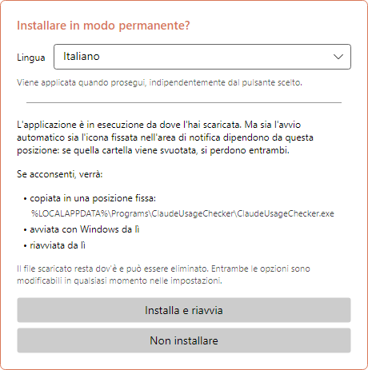
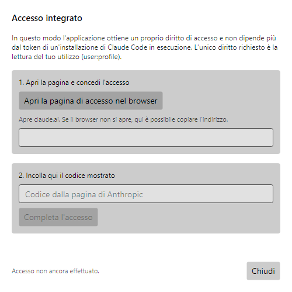
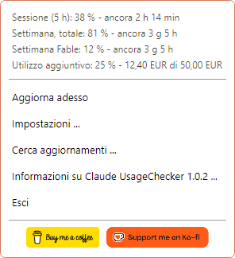
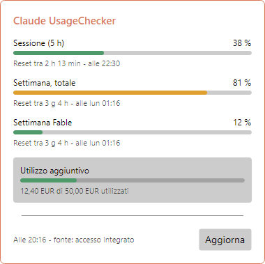
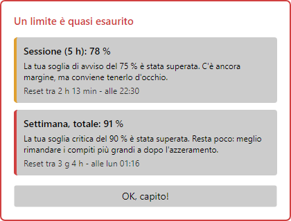
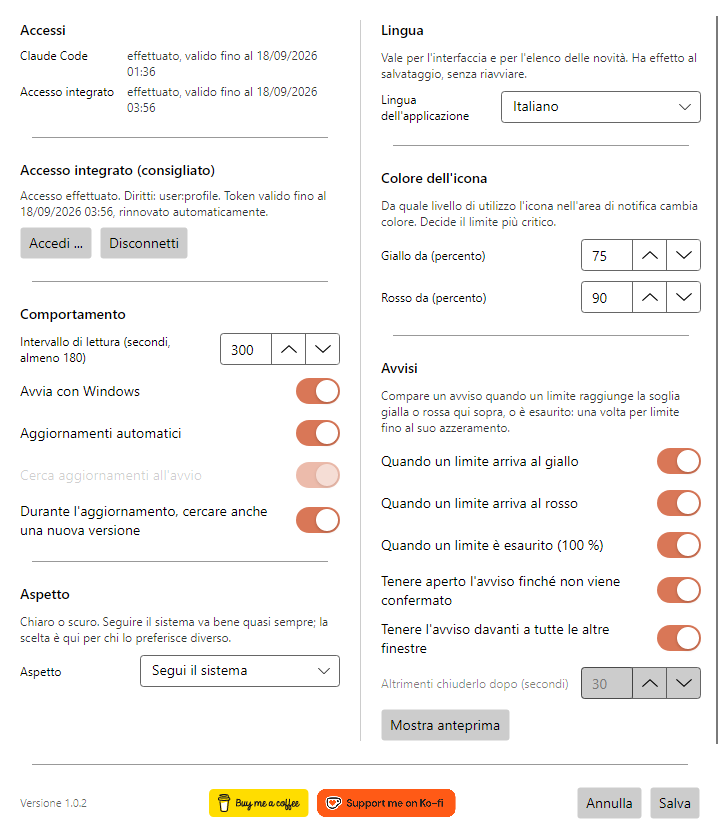
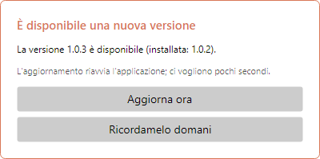
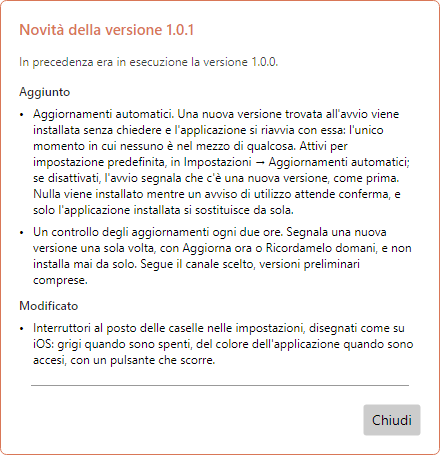
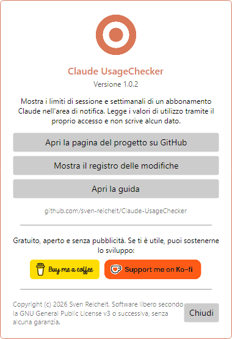

# Claude UsageChecker – Guida all'uso

[English](en.md) · [Deutsch](de.md) · [Español](es.md) · [Français](fr.md) · **Italiano** · [Português (Brasil)](pt-BR.md) · [Português (Portugal)](pt-PT.md) · [Русский](ru.md) · [简体中文](zh-Hans.md)

Claude UsageChecker mostra in modo permanente, nell'area di notifica di Windows o
nella barra dei menu di macOS, quanto hai consumato del tuo abbonamento Claude: il
limite di sessione di cinque ore e i limiti settimanali. Questa guida percorre
tutto ciò che l'applicazione fa, finestra per finestra.

Le immagini mostrano Windows. Su macOS le finestre sono identiche; solo il menu
nella barra è disegnato dal sistema.

## Indice

1. [Installazione](#1-installazione)
2. [Il primo avvio](#2-il-primo-avvio)
3. [Accedere](#3-accedere)
4. [L'icona](#4-licona)
5. [Il menu](#5-il-menu)
6. [La finestra dei dettagli](#6-la-finestra-dei-dettagli)
7. [Avvisi](#7-avvisi)
8. [Impostazioni](#8-impostazioni)
9. [Aggiornamenti](#9-aggiornamenti)
10. [Informazioni e sostegno al progetto](#10-informazioni-e-sostegno-al-progetto)
11. [Disinstallazione](#11-disinstallazione)
12. [Quando qualcosa non funziona](#12-quando-qualcosa-non-funziona)

## 1. Installazione

Scarica l'ultima versione dalla
[pagina delle versioni](https://github.com/sven-reichelt/Claude-UsageChecker/releases/latest).
Non serve altro: né runtime .NET né programma di installazione.

**Windows 10 o 11:** scarica `ClaudeUsageChecker.exe` e avvialo. Poiché il file non
è firmato, la prima volta Windows SmartScreen segnala un editore sconosciuto. Fai
clic su **Ulteriori informazioni** e poi su **Esegui comunque**.

**macOS 12 o successivo, Apple silicon:** scarica
`ClaudeUsageChecker-macos-arm64.dmg`, aprilo e fai doppio clic sull'applicazione al
suo interno. macOS chiede una volta se vuoi aprire un'applicazione scaricata da
internet; fai clic su **Apri**. Non usare lo `.zip`: esiste solo per
l'aggiornamento automatico.

## 2. Il primo avvio

Al primo avvio l'applicazione propone di installarsi stabilmente:

* su **Windows** si copia in `%LOCALAPPDATA%\Programs\ClaudeUsageChecker`, si avvia
  con Windows da lì e si riavvia;
* su **macOS** si sposta nella cartella Applicazioni, si avvia all'accesso da lì, si
  riavvia ed espelle l'immagine disco.

Scegli prima la **lingua** in alto: la finestra cambia subito e la scelta resta
qualunque pulsante tu prema. **Installa e riavvia** è consigliato: avvio automatico
e aggiornamento automatico funzionano solo dalla posizione definitiva. **Non
installare** lascia tutto dov'è; l'avvio automatico si può attivare più tardi nelle
impostazioni.

## 3. Accedere

L'applicazione ha bisogno del permesso di leggere il tuo utilizzo. Le strade sono
due e le prova entrambe:

* **Il proprio accesso (consigliato).** Indipendente da Claude Code, e si mantiene
  valido da sé.
* **Il token di Claude Code.** Se Claude Code è installato e connesso sulla stessa
  macchina, l'applicazione ne legge il token: in sola lettura, non riscrive mai
  nulla.

Per accedere apri **Impostazioni** e fai clic su **Accedi …**:

1. Fai clic su **Apri la pagina di accesso nel browser**. Si apre claude.ai;
   concedi lì l'accesso.
2. La pagina mostra un codice. Copialo, incollalo nel campo e fai clic su
   **Completa l'accesso**.

L'unico permesso richiesto è leggere il tuo utilizzo (`user:profile`): non inviare
richieste a tuo nome, non creare chiavi API. L'accesso viene salvato cifrato nella
Gestione credenziali di Windows o nel portachiavi di macOS.

## 4. L'icona

L'icona nell'area di notifica o nella barra dei menu mostra a colpo d'occhio quanto
è stato consumato. Decide il limite più critico:

| Icona | Significato |
| --- | --- |
|  | Tutto nei limiti |
|  | Un limite ha raggiunto la soglia gialla (75 % di default) |
|  | Un limite ha raggiunto la soglia rossa (90 % di default) |
|  | Non connesso, o nessuna connessione |

Su **Windows**, puntando l'icona compaiono la sessione e il limite settimanale con
l'ora di azzeramento. Un clic sinistro apre la
[finestra dei dettagli](#6-la-finestra-dei-dettagli), uno destro il
[menu](#5-il-menu).

> **Consiglio per Windows:** le icone nuove finiscono nell'area di overflow, dietro
> la freccetta. Trascina l'icona sulla barra delle applicazioni per tenerla in vista.

Su **macOS** un clic sull'icona apre il menu.

## 5. Il menu

In alto il menu elenca **tutti i limiti** segnalati per il tuo abbonamento, con il
tempo che manca all'azzeramento, compresi i limiti settimanali per modello e
l'utilizzo aggiuntivo, se attivo. Sotto:

* **Aggiorna ora** – recupera subito i valori invece di attendere la chiamata
  successiva.
* **Impostazioni …** – vedi [Impostazioni](#8-impostazioni).
* **Controlla aggiornamenti …** – cerca ora una nuova versione.
* **Informazioni su Claude UsageChecker …** – mostra versione, elenco delle
  modifiche e questa guida.
* **Esci** – chiude l'applicazione.

Su macOS il menu contiene inoltre **Mostra dettagli …**, e i due pulsanti di
sostegno compaiono come voci di testo.

## 6. La finestra dei dettagli

Ogni limite con la sua barra, la percentuale, il tempo rimanente e il momento
dell'azzeramento:

* **Sessione (5 h)** – il limite mobile di cinque ore.
* **Settimana, totale** – il limite di sette giorni su tutti i modelli.
* **Settimana** seguito dal nome di un modello – un limite per quel modello.
  Compare solo dopo che quel modello è stato usato nella settimana in corso.
* **Utilizzo aggiuntivo** – l'importo speso sul tetto mensile, nella valuta del tuo
  account, se l'utilizzo aggiuntivo è attivo.

Le barre prendono i colori delle tue soglie: verde sotto il giallo, poi giallo, poi
rosso. In fondo si legge quando i valori sono stati recuperati e da dove viene
l'accesso. **Aggiorna** li richiede di nuovo. La finestra si chiude facendo clic
altrove o premendo Esc.

## 7. Avvisi

Un'icona sfugge facilmente, perciò compare un avviso quando un limite raggiunge il
**giallo**, il **rosso** o il **100 %**. Indica il limite, a che punto è, cosa
significa e quando verrà azzerato.

* Ogni livello viene annunciato **una volta per limite** fino al suo azzeramento, e
  ricordato anche dopo un riavvio.
* Più limiti insieme condividono un unico avviso.
* Per impostazione predefinita l'avviso resta in primo piano finché non fai clic su
  **OK, capito!**.
* Non ruba la tastiera: quello che stai scrivendo prosegue.
* Un avviso su un limite ormai azzerato si chiude da solo.

Quanto insiste lo decidi nelle [impostazioni](#avvisi).

## 8. Impostazioni

Le modifiche hanno effetto con **Salva**; **Annulla** le scarta.

### Accessi

In alto: se Claude Code è connesso su questa macchina e se funziona l'accesso
proprio dell'applicazione — sempre entrambi, qualunque sia quello in uso. Sotto,
**Accedi …** e **Esci** per l'accesso proprio.

### Comportamento

* **Intervallo di interrogazione** – ogni quanto vengono recuperati i valori, in
  secondi. Almeno 180: il servizio limita qualsiasi ritmo più veloce.
* **Avvia con Windows** / **Avvia all'accesso** – avvia l'applicazione quando entri
  nel computer. Se la voce dovesse sparire, l'applicazione la ripristina al proprio
  avvio successivo.
* **Aggiornamenti automatici** – installa una nuova versione all'avvio, senza
  chiedere. Vedi [Aggiornamenti](#9-aggiornamenti).
* **Controlla aggiornamenti all'avvio** – disponibile solo con gli aggiornamenti
  automatici disattivati: l'avvio segnala allora che c'è una nuova versione.
* **Cerca una nuova versione anche durante l'aggiornamento dei valori** – il
  pulsante **Aggiorna** della finestra dei dettagli cerca anche gli aggiornamenti.

### Aspetto

Chiaro, scuro o come il sistema. La finestra cambia già mentre scegli, così puoi
vederlo prima di salvare.

### Lingua

La lingua di tutta l'applicazione, compreso l'elenco delle novità dopo un
aggiornamento. Ha effetto al salvataggio, senza riavvio.

### Colore dell'icona

Da quale utilizzo icona, barre e avvisi passano al **giallo** e al **rosso**. Il
giallo deve stare sotto il rosso.

### Avvisi

* Per quali livelli arriva un avviso: **giallo**, **rosso**, **esaurito (100 %)**.
* **Tenere aperto l'avviso finché non viene confermato** — altrimenti si chiude da
  solo dopo i secondi indicati sotto.
* **Tenere l'avviso davanti a tutte le altre finestre**.
* **Mostra anteprima** – mostra un avviso con valori di esempio, per vedere cosa
  fanno le scelte qui sopra.

In fondo alla finestra ci sono il numero di versione e i
[pulsanti di sostegno](#10-informazioni-e-sostegno-al-progetto).

## 9. Aggiornamenti

L'applicazione si tiene aggiornata da sola. Ogni file scaricato viene confrontato
con la somma SHA-256 pubblicata prima che venga eseguito qualcosa, e su macOS anche
con la firma.

**Con gli aggiornamenti automatici attivi** (impostazione predefinita), una nuova
versione trovata all'avvio viene installata senza chiedere. L'applicazione si
riavvia con essa in pochi secondi e mostra le novità.

**Con gli aggiornamenti automatici disattivati**, l'avvio segnala che c'è una nuova
versione e l'installazione resta un clic su **Installa e riavvia**.

**In entrambi i casi** l'applicazione controlla ogni due ore in background. Quando
trova una nuova versione chiede **una volta**:

* **Aggiorna ora** – la installa e riavvia.
* **Ricordamelo domani** – chiede di nuovo tra 24 ore. Se nel frattempo il computer
  viene riavviato, l'aggiornamento viene installato all'avvio se gli aggiornamenti
  automatici sono attivi.

Finché un avviso di utilizzo attende conferma, non viene installato nulla.

Dopo un aggiornamento l'applicazione mostra cosa è cambiato rispetto alla tua
versione precedente, anche attraverso più versioni se ne hai saltata qualcuna.

## 10. Informazioni e sostegno al progetto

**Informazioni su Claude UsageChecker**, nel menu, mostra la versione e porta alla
pagina del progetto, all'elenco completo delle modifiche e a questa guida.

Claude UsageChecker è gratuito, aperto e senza pubblicità. Se ti è utile, i pulsanti
**Buy me a coffee** e **Support me on Ko-fi** — qui, nel menu e in fondo alle
impostazioni — portano alle pagine dove sostenerne lo sviluppo. Un clic apre solo la
pagina nel browser.

## 11. Disinstallazione

**Windows**

1. Fai clic destro sull'icona e scegli **Esci**.
2. Per togliere l'avvio automatico in modo pulito, apri prima le impostazioni,
   disattiva **Avvia con Windows** e salva — oppure elimina il valore
   `ClaudeUsageChecker` in
   `HKEY_CURRENT_USER\Software\Microsoft\Windows\CurrentVersion\Run`.
3. Elimina le cartelle `%LOCALAPPDATA%\Programs\ClaudeUsageChecker`
   (l'applicazione) e `%LOCALAPPDATA%\ClaudeUsageChecker` (le impostazioni).
4. Nella Gestione credenziali di Windows rimuovi le voci che iniziano con
   `ClaudeUsageChecker:`.

**macOS**

1. Scegli **Esci** nel menu.
2. Elimina `/Applications/ClaudeUsageChecker.app`,
   `~/Library/Application Support/ClaudeUsageChecker` e
   `~/Library/LaunchAgents/de.sven-reichelt.claudeusagechecker.plist`.
3. In Accesso Portachiavi rimuovi le voci che iniziano con `ClaudeUsageChecker:`.

L'elenco completo di cosa viene salvato e dove è in
[SECURITY.md](../../SECURITY.md#2a-what-the-application-stores-where---in-full).

## 12. Quando qualcosa non funziona

**L'icona resta grigia.** L'applicazione non ha accesso. Apri le impostazioni:
almeno uno dei due accessi deve indicare *connesso*. Altrimenti accedi di nuovo.

**«Il tuo accesso è scaduto».** Anthropic non documenta quanto dura un accesso
inutilizzato. Accedi di nuovo in **Impostazioni → Accedi …**; fino ad allora viene
usato il token di Claude Code, se c'è.

**Nessun valore, «l'API sta limitando le richieste».** Il servizio limita la
frequenza delle domande. L'applicazione attende da sola e riprova; un intervallo più
breve peggiora le cose, non le migliora.

**Un avviso non compare.** Ogni livello viene annunciato una volta per limite fino
al suo azzeramento. Controlla in **Impostazioni → Avvisi** che il livello sia
attivo e prova **Mostra anteprima**.

**Windows segnala un editore sconosciuto.** È previsto: il file non è firmato.
**Ulteriori informazioni → Esegui comunque**.

**macOS si rifiuta di aprire l'applicazione.** Usa il `.dmg`, non lo `.zip`. Se il
rifiuto arriva subito dopo la pubblicazione di una nuova versione, riprova poco più
tardi.

**Altro.** L'applicazione scrive un `crash.log` accanto alle sue impostazioni:
`%LOCALAPPDATA%\ClaudeUsageChecker\crash.log` su Windows,
`~/Library/Application Support/ClaudeUsageChecker/crash.log` su macOS. Non contiene
token. Per favore
[segnala il problema](https://github.com/sven-reichelt/Claude-UsageChecker/issues/new/choose)
allegandolo — ma non incollare mai un token di accesso.
