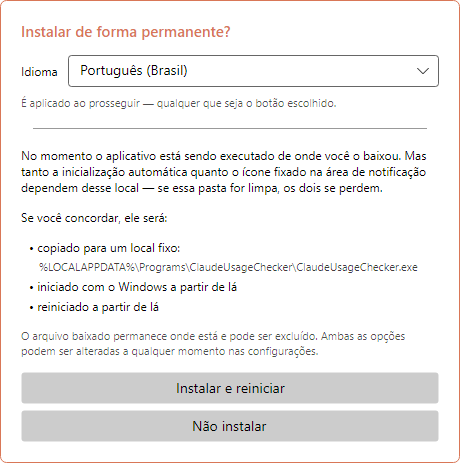
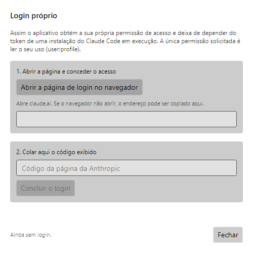
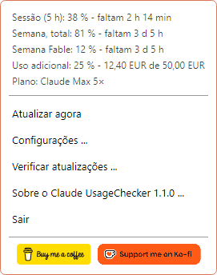
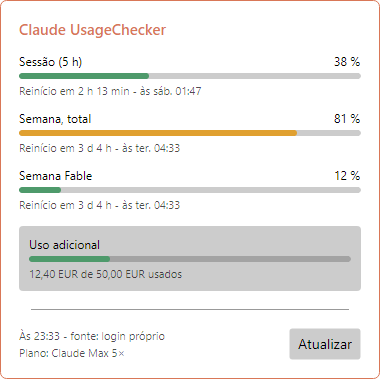
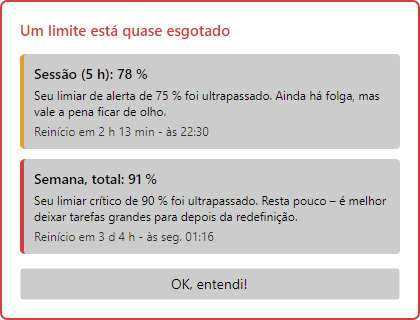
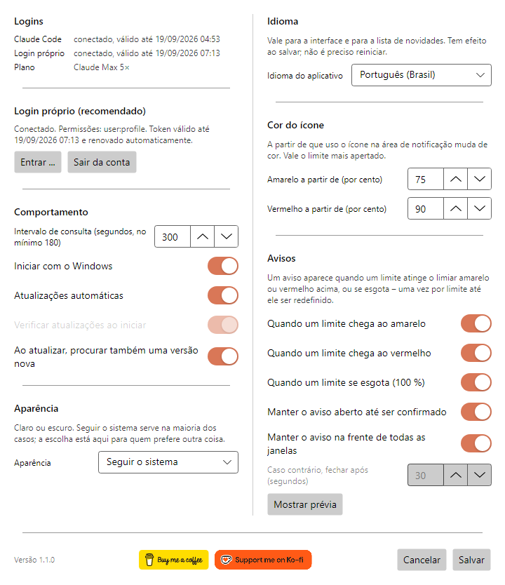
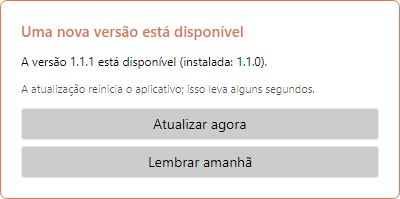
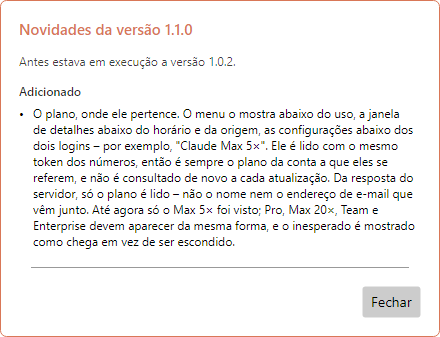
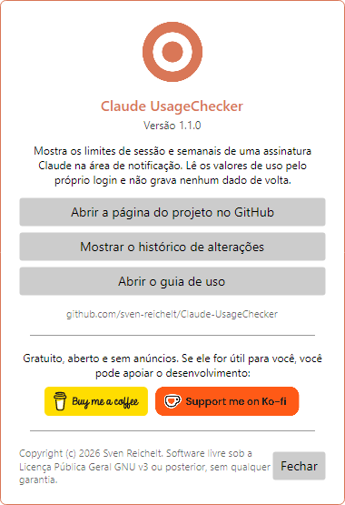

# Claude UsageChecker – Guia de uso

[English](en.md) · [Deutsch](de.md) · [Español](es.md) · [Français](fr.md) · [Italiano](it.md) · **Português (Brasil)** · [Português (Portugal)](pt-PT.md) · [Русский](ru.md) · [简体中文](zh-Hans.md)

O Claude UsageChecker mostra permanentemente, na área de notificação do Windows ou
na barra de menus do macOS, quanto você já usou da sua assinatura do Claude: o
limite de sessão de cinco horas e os limites semanais. Este guia percorre tudo o que
o aplicativo faz, janela por janela.

As imagens são do Windows. No macOS as janelas são iguais; só o menu na barra é
desenhado pelo sistema.

## Conteúdo

1. [Instalação](#1-instalação)
2. [A primeira execução](#2-a-primeira-execução)
3. [Entrar](#3-entrar)
4. [O ícone](#4-o-ícone)
5. [O menu](#5-o-menu)
6. [A janela de detalhes](#6-a-janela-de-detalhes)
7. [Avisos](#7-avisos)
8. [Configurações](#8-configurações)
9. [Atualizações](#9-atualizações)
10. [Sobre e apoio ao projeto](#10-sobre-e-apoio-ao-projeto)
11. [Desinstalação](#11-desinstalação)
12. [Quando algo não funciona](#12-quando-algo-não-funciona)

## 1. Instalação

Baixe a versão mais recente na
[página de versões](https://github.com/sven-reichelt/Claude-UsageChecker/releases/latest).
Nada mais é necessário: nem runtime .NET nem instalador.

**Windows 10 ou 11:** baixe `ClaudeUsageChecker.exe` e inicie-o. Como o arquivo não
é assinado, na primeira vez o Windows SmartScreen informa um editor desconhecido.
Clique em **Mais informações** e depois em **Executar assim mesmo**.

**macOS 12 ou mais recente, Apple silicon:** baixe
`ClaudeUsageChecker-macos-arm64.dmg`, abra-o e dê dois cliques no aplicativo dentro
dele. O macOS pergunta uma vez se você quer abrir um aplicativo baixado da internet;
clique em **Abrir**. Não use o `.zip`: ele existe apenas para a atualização
automática.

## 2. A primeira execução

Na primeira execução o aplicativo se oferece para se instalar de forma permanente:

* no **Windows** ele se copia para `%LOCALAPPDATA%\Programs\ClaudeUsageChecker`,
  passa a iniciar com o Windows a partir dali e reinicia;
* no **macOS** ele vai para a pasta Aplicativos, passa a iniciar no login a partir
  dali, reinicia e ejeta a imagem de disco.

Escolha primeiro o **idioma**, no alto: a janela muda na hora, e a escolha é
mantida em qualquer um dos botões. **Instalar e reiniciar** é o recomendado: a
inicialização automática e a autoatualização só funcionam a partir do local
definitivo. **Não instalar** deixa tudo onde está; a inicialização automática pode
ser ligada depois nas configurações.

## 3. Entrar

O aplicativo precisa de permissão para ler seu uso. Há dois caminhos, e ele tenta
os dois:

* **A entrada própria (recomendada).** Independente do Claude Code, e se mantém
  válida sozinha.
* **O token do Claude Code.** Se o Claude Code estiver instalado e conectado na
  mesma máquina, o aplicativo lê o token dele: somente leitura, nada é gravado de
  volta.

Para entrar, abra **Configurações** e clique em **Entrar …**:

1. Clique em **Abrir a página de login no navegador**. O claude.ai abre; conceda o
   acesso ali.
2. A página mostra um código. Copie-o, cole-o no campo e clique em **Concluir o
   login**.

A única permissão solicitada é ler seu uso (`user:profile`): não enviar
solicitações em seu nome, nem criar chaves de API. A entrada é guardada
criptografada no Gerenciador de Credenciais do Windows ou nas Chaves do macOS.

## 4. O ícone

O ícone na área de notificação ou na barra de menus mostra num relance quanto foi
consumido. Vale o limite mais apertado:

| Ícone | Significado |
| --- | --- |
|  | Tudo dentro do previsto |
|  | Um limite chegou ao limiar amarelo (75 % por padrão) |
|  | Um limite chegou ao limiar vermelho (90 % por padrão) |
|  | Sem login ou sem conexão |

No **Windows**, apontar para o ícone mostra a sessão e o limite semanal com o
horário de redefinição. Um clique esquerdo abre a
[janela de detalhes](#6-a-janela-de-detalhes); o direito, o [menu](#5-o-menu).

> **Dica para o Windows:** ícones novos vão para a área de estouro, atrás da
> setinha. Arraste o ícone para a barra de tarefas para mantê-lo à vista.

No **macOS**, um clique no ícone abre o menu.

## 5. O menu

No alto, o menu lista **todos os limites** informados para a sua assinatura, com o
tempo restante até a redefinição — inclusive os limites semanais por modelo e o uso
adicional, se estiver ativado. Abaixo:

* **Atualizar agora** – busca os valores na hora, em vez de esperar a próxima
  consulta.
* **Configurações …** – veja [Configurações](#8-configurações).
* **Verificar atualizações …** – procura agora por uma versão nova.
* **Sobre o Claude UsageChecker …** – mostra a versão, o histórico de mudanças e
  este guia.
* **Sair** – encerra o aplicativo.

No macOS o menu traz ainda **Mostrar detalhes …**, e os dois botões de apoio
aparecem como itens de texto.

A última linha abaixo dos limites mostra o seu **plano** – por exemplo,
*Claude Max 5×*.

## 6. A janela de detalhes

Cada limite com barra, porcentagem, tempo restante e o momento da redefinição:

* **Sessão (5 h)** – o limite móvel de cinco horas.
* **Semana, total** – o limite de sete dias somando todos os modelos.
* **Semana** seguido do nome de um modelo – um limite daquele modelo. Só aparece
  depois que esse modelo foi usado na semana corrente.
* **Uso adicional** – o valor gasto do teto mensal, na moeda da sua conta, se o uso
  adicional estiver ativado.

As barras usam as cores dos seus limiares: verde abaixo do amarelo, depois amarelo,
depois vermelho. No rodapé está quando os valores foram buscados e de onde veio o
acesso. **Atualizar** busca de novo. A janela fecha ao clicar em outro lugar ou
pressionar Esc.

Abaixo da linha com o horário e a origem aparece o seu **plano**, por exemplo
*Claude Max 5×*: o plano da conta a que esses valores pertencem.

## 7. Avisos

Um ícone passa despercebido facilmente, por isso surge um aviso quando um limite
chega ao **amarelo**, ao **vermelho** ou a **100 %**. Ele diz qual limite é, até
onde chegou, o que isso significa e quando será redefinido.

* Cada nível é anunciado **uma vez por limite** até aquele limite ser redefinido — e
  isso é lembrado depois de reiniciar.
* Vários limites ao mesmo tempo dividem um único aviso.
* Por padrão o aviso fica à frente até você clicar em **OK, entendi!**.
* Ele não toma o teclado: o que você estiver digitando segue normalmente.
* Um aviso sobre um limite já redefinido se fecha sozinho.

O quanto ele insiste você decide nas [configurações](#avisos).

## 8. Configurações

As mudanças valem ao clicar em **Salvar**; **Cancelar** as descarta.

### Entradas

No alto: se o Claude Code está conectado nesta máquina e se a entrada própria do
aplicativo funciona — sempre as duas, qualquer que esteja em uso. Abaixo, **Entrar
…** e **Sair** para a entrada própria.

Abaixo dos dois logins aparece o seu **plano**, por exemplo *Claude Max 5×*, assim
que os valores tiverem sido buscados.

### Comportamento

* **Intervalo de consulta** – de quanto em quanto tempo os valores são buscados, em
  segundos. No mínimo 180: o serviço limita qualquer ritmo maior.
* **Iniciar com o Windows** / **Iniciar ao fazer login** – inicia o aplicativo
  quando você entra no computador. Se a entrada sumir, o aplicativo a recoloca na
  próxima inicialização.
* **Atualizações automáticas** – instala uma versão nova na inicialização, sem
  perguntar. Veja [Atualizações](#9-atualizações).
* **Verificar atualizações na inicialização** – disponível só com as atualizações
  automáticas desligadas: a inicialização avisa então que há uma versão nova.
* **Ao atualizar, procurar também uma versão nova** – o botão **Atualizar** da
  janela de detalhes passa a procurar atualizações também.

### Aparência

Clara, escura ou seguindo o sistema. A janela muda já na escolha, então dá para ver
antes de salvar.

### Idioma

O idioma de todo o aplicativo, inclusive a lista de novidades depois de uma
atualização. Vale ao salvar, sem reiniciar.

### Cor do ícone

A partir de que uso o ícone, as barras e os avisos ficam **amarelos** e
**vermelhos**. O amarelo precisa ficar abaixo do vermelho.

### Avisos

* Em quais níveis vem um aviso: **amarelo**, **vermelho**, **esgotado (100 %)**.
* **Manter o aviso aberto até ser confirmado** — caso contrário ele se fecha sozinho
  após os segundos indicados abaixo.
* **Manter o aviso na frente de todas as janelas**.
* **Mostrar prévia** – mostra um aviso com valores de exemplo, para ver o que as
  opções acima fazem.

No rodapé da janela estão o número da versão e os
[botões de apoio](#10-sobre-e-apoio-ao-projeto).

## 9. Atualizações

O aplicativo se mantém atualizado sozinho. Cada download é conferido contra a soma
SHA-256 publicada antes de qualquer execução — e, no macOS, também contra a
assinatura.

**Com as atualizações automáticas ligadas** (o padrão), uma versão nova encontrada
na inicialização é instalada sem perguntar. O aplicativo reinicia nela em poucos
segundos e mostra as novidades.

**Com as atualizações automáticas desligadas**, a inicialização avisa que há uma
versão nova, e instalar continua sendo um clique em **Instalar agora e reiniciar**.

**Nos dois casos** o aplicativo verifica a cada duas horas em segundo plano. Ao
encontrar uma versão nova, ele pergunta **uma vez**:

* **Atualizar agora** – instala e reinicia.
* **Lembrar amanhã** – pergunta de novo em 24 horas. Se o computador for reiniciado
  nesse meio-tempo, a atualização é instalada na inicialização, desde que as
  automáticas estejam ligadas.

Enquanto um aviso de uso espera confirmação, nada é instalado.

Depois de uma atualização o aplicativo mostra o que mudou desde a sua versão
anterior — inclusive ao longo de várias versões, se você pulou alguma.

## 10. Sobre e apoio ao projeto

**Sobre o Claude UsageChecker**, no menu, mostra a versão e leva à página do
projeto, ao histórico completo de mudanças e a este guia.

O Claude UsageChecker é gratuito, aberto e sem anúncios. Se ele for útil para você,
os botões **Buy me a coffee** e **Support me on Ko-fi** — aqui, no menu e no rodapé
das configurações — levam às páginas onde é possível apoiar o desenvolvimento. Um
clique só abre a página no navegador.

## 11. Desinstalação

**Windows**

1. Clique com o botão direito no ícone e escolha **Sair**.
2. Para remover a inicialização automática de forma limpa, abra antes as
   configurações, desligue **Iniciar com o Windows** e salve — ou apague o valor
   `ClaudeUsageChecker` em
   `HKEY_CURRENT_USER\Software\Microsoft\Windows\CurrentVersion\Run`.
3. Apague as pastas `%LOCALAPPDATA%\Programs\ClaudeUsageChecker` (o aplicativo) e
   `%LOCALAPPDATA%\ClaudeUsageChecker` (as configurações).
4. No Gerenciador de Credenciais do Windows, remova as entradas que começam com
   `ClaudeUsageChecker:`.

**macOS**

1. Escolha **Sair** no menu.
2. Apague `/Applications/ClaudeUsageChecker.app`,
   `~/Library/Application Support/ClaudeUsageChecker` e
   `~/Library/LaunchAgents/de.sven-reichelt.claudeusagechecker.plist`.
3. No Acesso às Chaves, remova as entradas que começam com `ClaudeUsageChecker:`.

A lista completa do que é guardado e onde está em
[SECURITY.md](../../SECURITY.md#2a-what-the-application-stores-where---in-full).

## 12. Quando algo não funciona

**O ícone continua cinza.** O aplicativo não tem acesso. Abra as configurações: pelo
menos uma das duas entradas precisa dizer *conectado*. Se não, entre de novo.

**«Sua entrada expirou».** Quanto tempo uma entrada dura sem uso não é documentado
pela Anthropic. Entre de novo em **Configurações → Entrar …**; até lá é usado o
token do Claude Code, se houver.

**Sem valores, «a API está limitando as solicitações».** O serviço limita com que
frequência pode ser consultado. O aplicativo espera sozinho e tenta de novo; um
intervalo menor piora as coisas, não melhora.

**Um aviso não aparece.** Cada nível é anunciado uma vez por limite até ele ser
redefinido. Confira em **Configurações → Avisos** se o nível está ligado e teste
**Mostrar prévia**.

**O Windows avisa sobre um editor desconhecido.** É esperado: o arquivo não é
assinado. **Mais informações → Executar assim mesmo**.

**O macOS se recusa a abrir o aplicativo.** Use o `.dmg`, não o `.zip`. Se a recusa
vier logo após a publicação de uma versão nova, tente um pouco mais tarde.

**Outra coisa.** O aplicativo escreve um `crash.log` ao lado das configurações:
`%LOCALAPPDATA%\ClaudeUsageChecker\crash.log` no Windows e
`~/Library/Application Support/ClaudeUsageChecker/crash.log` no macOS. Ele não
contém tokens. Por favor,
[relate o problema](https://github.com/sven-reichelt/Claude-UsageChecker/issues/new/choose)
anexando-o — mas nunca cole um token de acesso.
