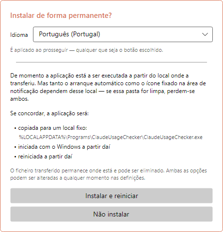
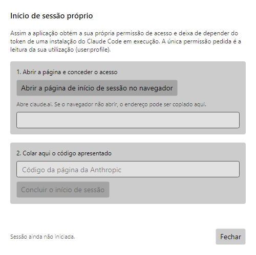
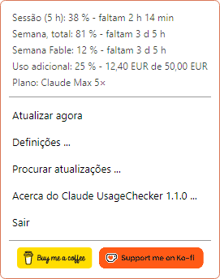
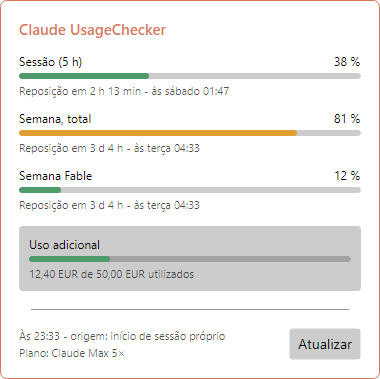
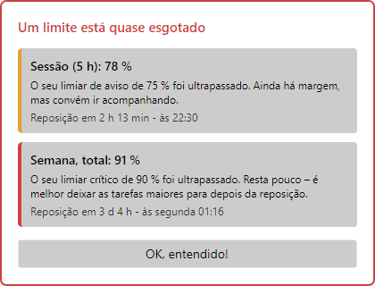
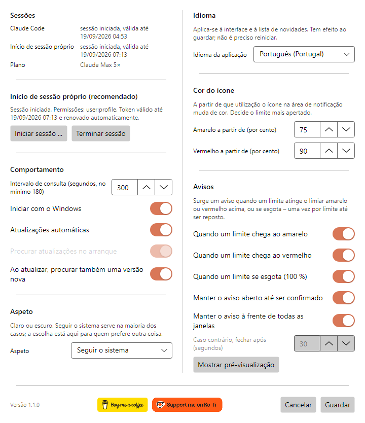
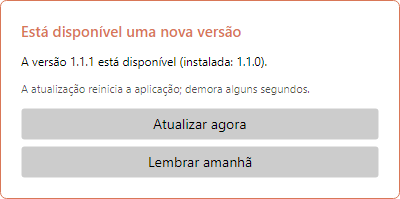
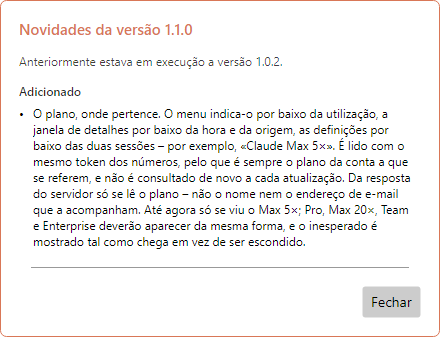
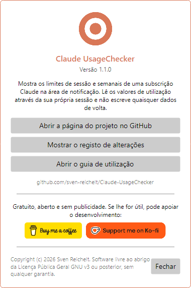

# Claude UsageChecker – Guia de utilização

[English](en.md) · [Deutsch](de.md) · [Español](es.md) · [Français](fr.md) · [Italiano](it.md) · [Português (Brasil)](pt-BR.md) · **Português (Portugal)** · [Русский](ru.md) · [简体中文](zh-Hans.md)

O Claude UsageChecker mostra permanentemente, na área de notificação do Windows ou
na barra de menus do macOS, quanto já utilizou da sua subscrição do Claude: o limite
de sessão de cinco horas e os limites semanais. Este guia percorre tudo o que a
aplicação faz, janela a janela.

As imagens são do Windows. No macOS as janelas são iguais; apenas o menu na barra é
desenhado pelo sistema.

## Conteúdo

1. [Instalação](#1-instalação)
2. [O primeiro arranque](#2-o-primeiro-arranque)
3. [Iniciar sessão](#3-iniciar-sessão)
4. [O ícone](#4-o-ícone)
5. [O menu](#5-o-menu)
6. [A janela de detalhes](#6-a-janela-de-detalhes)
7. [Avisos](#7-avisos)
8. [Definições](#8-definições)
9. [Atualizações](#9-atualizações)
10. [Acerca e apoio ao projeto](#10-acerca-e-apoio-ao-projeto)
11. [Desinstalação](#11-desinstalação)
12. [Quando algo não funciona](#12-quando-algo-não-funciona)

## 1. Instalação

Transfira a versão mais recente da
[página de versões](https://github.com/sven-reichelt/Claude-UsageChecker/releases/latest).
Não é preciso mais nada: nem runtime .NET nem instalador.

**Windows 10 ou 11:** transfira `ClaudeUsageChecker.exe` e inicie-o. Como o ficheiro
não está assinado, da primeira vez o Windows SmartScreen indica um editor
desconhecido. Clique em **Mais informações** e depois em **Executar mesmo assim**.

**macOS 12 ou mais recente, Apple silicon:** transfira
`ClaudeUsageChecker-macos-arm64.dmg`, abra-o e faça duplo clique na aplicação lá
dentro. O macOS pergunta uma vez se quer abrir uma aplicação transferida da
internet; clique em **Abrir**. Não use o `.zip`: existe apenas para a atualização
automática.

## 2. O primeiro arranque

No primeiro arranque a aplicação propõe instalar-se de forma permanente:

* no **Windows** copia-se para `%LOCALAPPDATA%\Programs\ClaudeUsageChecker`, passa a
  arrancar com o Windows a partir daí e reinicia;
* no **macOS** muda-se para a pasta Aplicações, passa a arrancar no início de sessão
  a partir daí, reinicia e ejeta a imagem de disco.

Escolha primeiro o **idioma**, em cima: a janela muda de imediato e a escolha
mantém-se qualquer que seja o botão. **Instalar e reiniciar** é o recomendado: o
arranque automático e a autoatualização só funcionam a partir do local definitivo.
**Não instalar** deixa tudo onde está; o arranque automático pode ser ligado mais
tarde nas definições.

## 3. Iniciar sessão

A aplicação precisa de permissão para ler a sua utilização. Há dois caminhos e
tenta ambos:

* **O início de sessão próprio (recomendado).** Independente do Claude Code, e
  mantém-se válido por si.
* **O token do Claude Code.** Se o Claude Code estiver instalado e com sessão
  iniciada na mesma máquina, a aplicação lê o token dele: apenas leitura, nunca
  escreve nada de volta.

Para iniciar sessão, abra **Definições** e clique em **Iniciar sessão …**:

1. Clique em **Abrir a página de início de sessão no navegador**. Abre o claude.ai;
   conceda aí o acesso.
2. A página mostra um código. Copie-o, cole-o no campo e clique em **Concluir o
   início de sessão**.

A única permissão pedida é ler a sua utilização (`user:profile`): não enviar pedidos
em seu nome, nem criar chaves de API. O início de sessão é guardado cifrado no
Gestor de Credenciais do Windows ou no porta-chaves do macOS.

## 4. O ícone

O ícone na área de notificação ou na barra de menus mostra num relance quanto foi
consumido. Decide o limite mais apertado:

| Ícone | Significado |
| --- | --- |
|  | Tudo dentro do previsto |
|  | Um limite atingiu o limiar amarelo (75 % por predefinição) |
|  | Um limite atingiu o limiar vermelho (90 % por predefinição) |
|  | Sem sessão iniciada ou sem ligação |

No **Windows**, apontar para o ícone mostra a sessão e o limite semanal com a hora
de reposição. Um clique esquerdo abre a
[janela de detalhes](#6-a-janela-de-detalhes); o direito, o [menu](#5-o-menu).

> **Sugestão para o Windows:** os ícones novos vão para a área de excesso, atrás da
> setinha. Arraste o ícone para a barra de tarefas para o manter à vista.

No **macOS**, um clique no ícone abre o menu.

## 5. O menu

Em cima, o menu lista **todos os limites** comunicados para a sua subscrição, com o
tempo que falta até à reposição — incluindo os limites semanais por modelo e a
utilização adicional, se estiver ativada. Por baixo:

* **Atualizar agora** – obtém os valores de imediato, em vez de esperar pela
  consulta seguinte.
* **Definições …** – ver [Definições](#8-definições).
* **Procurar atualizações …** – procura agora uma versão nova.
* **Acerca do Claude UsageChecker …** – mostra a versão, o registo de alterações e
  este guia.
* **Sair** – termina a aplicação.

No macOS o menu tem ainda **Mostrar detalhes …**, e os dois botões de apoio
aparecem como entradas de texto.

A última linha por baixo dos limites indica o seu **plano** – por exemplo,
*Claude Max 5×*.

## 6. A janela de detalhes

Cada limite com barra, percentagem, tempo restante e o momento da reposição:

* **Sessão (5 h)** – o limite móvel de cinco horas.
* **Semana, total** – o limite de sete dias para todos os modelos.
* **Semana** seguido do nome de um modelo – um limite desse modelo. Só aparece
  depois de esse modelo ter sido usado na semana em curso.
* **Utilização adicional** – o montante gasto do limite mensal, na moeda da sua
  conta, se a utilização adicional estiver ativada.

As barras usam as cores dos seus limiares: verde abaixo do amarelo, depois amarelo,
depois vermelho. No fundo indica-se quando os valores foram obtidos e de onde vem o
acesso. **Atualizar** obtém-nos de novo. A janela fecha ao clicar noutro sítio ou ao
premir Esc.

Por baixo da linha com a hora e a origem aparece o seu **plano**, por exemplo
*Claude Max 5×*: o plano da conta a que estes valores pertencem.

## 7. Avisos

Um ícone passa facilmente despercebido, por isso surge um aviso quando um limite
atinge o **amarelo**, o **vermelho** ou os **100 %**. Indica o limite, até onde
chegou, o que isso significa e quando será reposto.

* Cada nível é anunciado **uma vez por limite** até esse limite ser reposto — e isso
  é recordado depois de reiniciar.
* Vários limites ao mesmo tempo partilham um único aviso.
* Por predefinição o aviso fica à frente até clicar em **OK, entendido!**.
* Não toma o teclado: o que estiver a escrever continua.
* Um aviso sobre um limite já reposto fecha-se sozinho.

O quanto insiste decide-o nas [definições](#avisos).

## 8. Definições

As alterações aplicam-se ao clicar em **Guardar**; **Cancelar** descarta-as.

### Inícios de sessão

Em cima: se o Claude Code tem sessão iniciada nesta máquina e se o início de sessão
próprio da aplicação funciona — sempre ambos, seja qual for o que está em uso. Por
baixo, **Iniciar sessão …** e **Terminar sessão** para o início de sessão próprio.

Por baixo das duas sessões aparece o seu **plano**, por exemplo *Claude Max 5×*, logo
que os valores tenham sido obtidos.

### Comportamento

* **Intervalo de consulta** – de quanto em quanto tempo os valores são obtidos, em
  segundos. No mínimo 180: o serviço limita qualquer ritmo maior.
* **Iniciar com o Windows** / **Iniciar ao iniciar sessão** – arranca a aplicação
  quando entra no computador. Se a entrada desaparecer, a aplicação repõe-na no
  arranque seguinte.
* **Atualizações automáticas** – instala uma versão nova no arranque, sem
  perguntar. Ver [Atualizações](#9-atualizações).
* **Procurar atualizações no arranque** – disponível apenas com as atualizações
  automáticas desligadas: o arranque avisa então que existe uma versão nova.
* **Ao atualizar, procurar também uma versão nova** – o botão **Atualizar** da
  janela de detalhes passa a procurar também atualizações.

### Aspeto

Claro, escuro ou a seguir o sistema. A janela muda logo ao escolher, pelo que pode
ver antes de guardar.

### Idioma

O idioma de toda a aplicação, incluindo a lista de novidades depois de uma
atualização. Aplica-se ao guardar, sem reiniciar.

### Cor do ícone

A partir de que utilização o ícone, as barras e os avisos ficam **amarelos** e
**vermelhos**. O amarelo tem de ficar abaixo do vermelho.

### Avisos

* Em que níveis surge um aviso: **amarelo**, **vermelho**, **esgotado (100 %)**.
* **Manter o aviso aberto até ser confirmado** — caso contrário fecha-se sozinho ao
  fim dos segundos indicados abaixo.
* **Manter o aviso à frente de todas as janelas**.
* **Mostrar pré-visualização** – mostra um aviso com valores de exemplo, para ver o
  que fazem as opções acima.

No fundo da janela estão o número de versão e os
[botões de apoio](#10-acerca-e-apoio-ao-projeto).

## 9. Atualizações

A aplicação mantém-se atualizada sozinha. Cada transferência é verificada contra a
soma SHA-256 publicada antes de algo ser executado — e, no macOS, também contra a
assinatura.

**Com as atualizações automáticas ligadas** (a predefinição), uma versão nova
encontrada no arranque é instalada sem perguntar. A aplicação reinicia nela em
poucos segundos e mostra as novidades.

**Com as atualizações automáticas desligadas**, o arranque avisa que existe uma
versão nova, e instalar continua a ser um clique em **Instalar agora e reiniciar**.

**Nos dois casos** a aplicação verifica de duas em duas horas em segundo plano.
Quando encontra uma versão nova, pergunta **uma vez**:

* **Atualizar agora** – instala e reinicia.
* **Lembrar amanhã** – volta a perguntar dentro de 24 horas. Se o computador for
  reiniciado entretanto, a atualização é instalada no arranque, desde que as
  automáticas estejam ligadas.

Enquanto um aviso de utilização espera confirmação, nada é instalado.

Depois de uma atualização a aplicação mostra o que mudou desde a sua versão
anterior — mesmo ao longo de várias versões, se saltou alguma.

## 10. Acerca e apoio ao projeto

**Acerca do Claude UsageChecker**, no menu, mostra a versão e leva à página do
projeto, ao registo de alterações completo e a este guia.

O Claude UsageChecker é gratuito, aberto e sem publicidade. Se lhe for útil, os
botões **Buy me a coffee** e **Support me on Ko-fi** — aqui, no menu e no fundo das
definições — levam às páginas onde pode apoiar o desenvolvimento. Um clique apenas
abre a página no navegador.

## 11. Desinstalação

**Windows**

1. Clique com o botão direito no ícone e escolha **Sair**.
2. Para remover o arranque automático de forma limpa, abra antes as definições,
   desligue **Iniciar com o Windows** e guarde — ou apague o valor
   `ClaudeUsageChecker` em
   `HKEY_CURRENT_USER\Software\Microsoft\Windows\CurrentVersion\Run`.
3. Apague as pastas `%LOCALAPPDATA%\Programs\ClaudeUsageChecker` (a aplicação) e
   `%LOCALAPPDATA%\ClaudeUsageChecker` (as definições).
4. No Gestor de Credenciais do Windows, remova as entradas que começam por
   `ClaudeUsageChecker:`.

**macOS**

1. Escolha **Sair** no menu.
2. Apague `/Applications/ClaudeUsageChecker.app`,
   `~/Library/Application Support/ClaudeUsageChecker` e
   `~/Library/LaunchAgents/de.sven-reichelt.claudeusagechecker.plist`.
3. No Acesso a Chaves, remova as entradas que começam por `ClaudeUsageChecker:`.

A lista completa do que é guardado e onde está em
[SECURITY.md](../../SECURITY.md#2a-what-the-application-stores-where---in-full).

## 12. Quando algo não funciona

**O ícone continua cinzento.** A aplicação não tem acesso. Abra as definições: pelo
menos um dos dois inícios de sessão tem de indicar *com sessão iniciada*. Caso
contrário, inicie sessão de novo.

**«O seu início de sessão expirou».** Quanto tempo dura um início de sessão sem uso
não é documentado pela Anthropic. Inicie sessão de novo em **Definições → Iniciar
sessão …**; até lá é usado o token do Claude Code, se existir.

**Sem valores, «a API está a limitar os pedidos».** O serviço limita a frequência
com que pode ser consultado. A aplicação espera por si e tenta de novo; um intervalo
mais curto piora as coisas, não as melhora.

**Um aviso não aparece.** Cada nível é anunciado uma vez por limite até este ser
reposto. Verifique em **Definições → Avisos** se o nível está ligado e experimente
**Mostrar pré-visualização**.

**O Windows avisa de um editor desconhecido.** É o esperado: o ficheiro não está
assinado. **Mais informações → Executar mesmo assim**.

**O macOS recusa-se a abrir a aplicação.** Use o `.dmg`, não o `.zip`. Se a recusa
surgir logo depois de ser publicada uma versão nova, tente um pouco mais tarde.

**Outra coisa.** A aplicação escreve um `crash.log` ao lado das definições:
`%LOCALAPPDATA%\ClaudeUsageChecker\crash.log` no Windows e
`~/Library/Application Support/ClaudeUsageChecker/crash.log` no macOS. Não contém
tokens. Por favor,
[comunique o problema](https://github.com/sven-reichelt/Claude-UsageChecker/issues/new/choose)
anexando-o — mas nunca cole um token de acesso.
