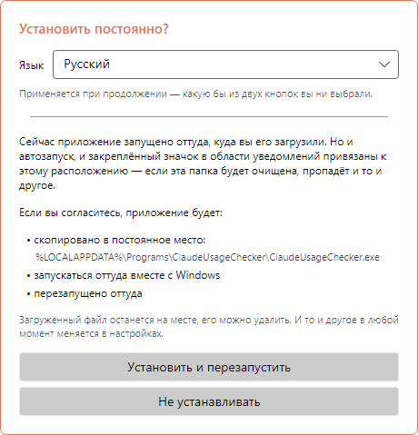
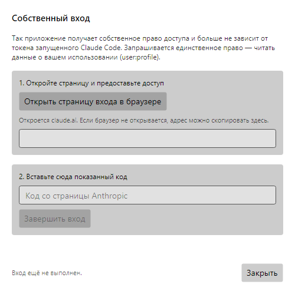
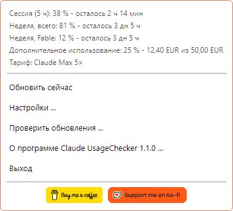
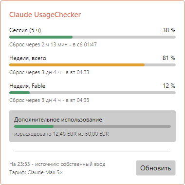
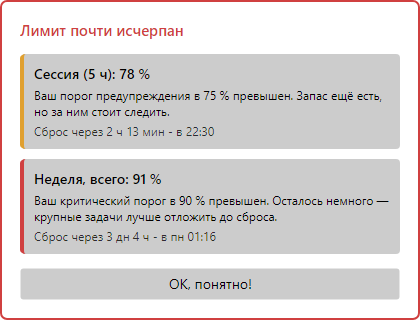
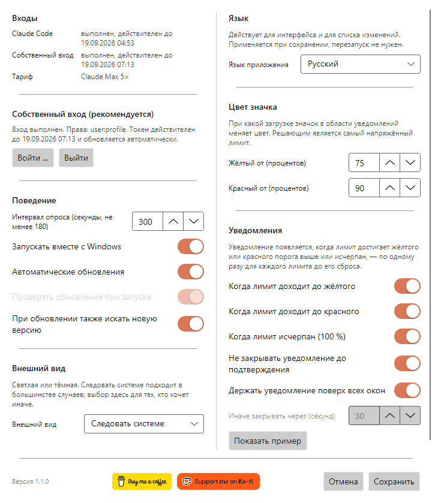
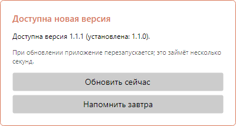
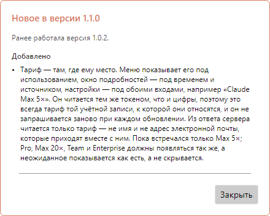
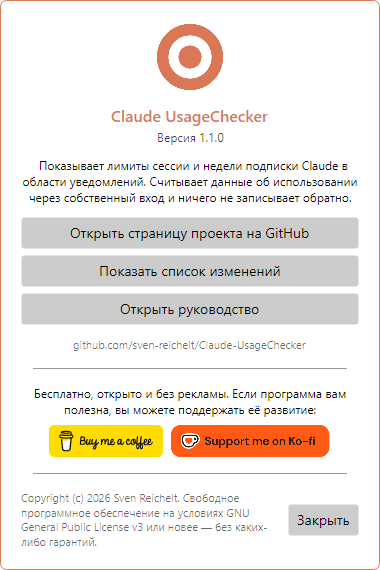

# Claude UsageChecker – Руководство пользователя

[English](en.md) · [Deutsch](de.md) · [Español](es.md) · [Français](fr.md) · [Italiano](it.md) · [Português (Brasil)](pt-BR.md) · [Português (Portugal)](pt-PT.md) · **Русский** · [简体中文](zh-Hans.md)

Claude UsageChecker постоянно показывает в области уведомлений Windows или в строке
меню macOS, сколько израсходовано от вашей подписки Claude: пятичасовой лимит сессии
и недельные лимиты. Это руководство проходит по всему, что делает приложение, окно
за окном.

Снимки сделаны в Windows. В macOS окна выглядят так же; только меню в строке меню
рисует сама система.

## Содержание

1. [Установка](#1-установка)
2. [Первый запуск](#2-первый-запуск)
3. [Вход](#3-вход)
4. [Значок](#4-значок)
5. [Меню](#5-меню)
6. [Окно подробностей](#6-окно-подробностей)
7. [Уведомления](#7-уведомления)
8. [Настройки](#8-настройки)
9. [Обновления](#9-обновления)
10. [О программе и поддержка проекта](#10-о-программе-и-поддержка-проекта)
11. [Удаление](#11-удаление)
12. [Если что-то не работает](#12-если-что-то-не-работает)

## 1. Установка

Скачайте последнюю версию со
[страницы выпусков](https://github.com/sven-reichelt/Claude-UsageChecker/releases/latest).
Больше ничего не нужно: ни среды .NET, ни установщика.

**Windows 10 или 11:** скачайте `ClaudeUsageChecker.exe` и запустите. Файл не
подписан, поэтому в первый раз Windows SmartScreen сообщает о неизвестном издателе.
Нажмите **Подробнее**, затем **Выполнить в любом случае**.

**macOS 12 и новее, Apple silicon:** скачайте
`ClaudeUsageChecker-macos-arm64.dmg`, откройте его и дважды щёлкните приложение
внутри. macOS один раз спросит, открывать ли приложение, загруженное из интернета;
нажмите **Открыть**. Не используйте `.zip`: он нужен только для самообновления.

## 2. Первый запуск

При первом запуске приложение предлагает установить себя насовсем:

* в **Windows** оно копирует себя в
  `%LOCALAPPDATA%\Programs\ClaudeUsageChecker`, запускается оттуда вместе с Windows
  и перезапускается;
* в **macOS** переходит в папку «Программы», запускается оттуда при входе в систему,
  перезапускается и извлекает образ диска.

Сначала выберите **язык** вверху: окно меняется сразу, и выбор сохраняется, какую бы
кнопку вы ни нажали. Рекомендуется **Установить и перезапустить**: автозапуск и
самообновление работают только из постоянного места. **Не устанавливать** оставляет
всё как есть; автозапуск можно включить позже в настройках.

## 3. Вход

Приложению нужно право читать ваше использование. Есть два пути, и оно пробует оба:

* **Собственный вход (рекомендуется).** Не зависит от Claude Code и сам поддерживает
  свою действительность.
* **Токен Claude Code.** Если Claude Code установлен на том же компьютере и в него
  выполнен вход, приложение читает его токен — только читает, ничего не записывает
  обратно.

Чтобы войти, откройте **Настройки** и нажмите **Войти …**:

1. Нажмите **Открыть страницу входа в браузере**. Откроется claude.ai; предоставьте
   там доступ.
2. Страница покажет код. Скопируйте его, вставьте в поле и нажмите **Завершить
   вход**.

Запрашивается единственное право — читать ваше использование (`user:profile`): не
отправлять запросы от вашего имени и не создавать ключи API. Вход хранится
зашифрованным в диспетчере учётных данных Windows или в связке ключей macOS.

## 4. Значок

Значок в области уведомлений или в строке меню показывает с одного взгляда, сколько
израсходовано. Решает самый напряжённый лимит:

| Значок | Значение |
| --- | --- |
|  | Всё в пределах нормы |
|  | Лимит достиг жёлтого порога (по умолчанию 75 %) |
|  | Лимит достиг красного порога (по умолчанию 90 %) |
|  | Вход не выполнен или нет соединения |

В **Windows** наведение на значок показывает сессию и недельный лимит со временем
сброса. Щелчок левой кнопкой открывает
[окно подробностей](#6-окно-подробностей), правой — [меню](#5-меню).

> **Совет для Windows:** новые значки попадают в область переполнения, за маленькую
> стрелку. Перетащите значок на панель задач, чтобы он оставался на виду.

В **macOS** щелчок по значку открывает меню.

## 5. Меню

Сверху меню перечисляет **все лимиты**, о которых сообщает ваша подписка, с
оставшимся временем до сброса — включая недельные лимиты по моделям и
дополнительное использование, если оно включено. Ниже:

* **Обновить сейчас** — получает значения немедленно, не дожидаясь следующего
  запроса.
* **Настройки …** — см. [Настройки](#8-настройки).
* **Проверить обновления …** — ищет новую версию сейчас.
* **О программе Claude UsageChecker …** — показывает версию, список изменений и это
  руководство.
* **Выход** — завершает работу приложения.

В macOS в меню есть ещё **Показать подробности …**, а две кнопки поддержки
появляются как текстовые пункты.

Последняя строка под лимитами называет ваш **тариф** — например, *Claude Max 5×*.

## 6. Окно подробностей

Каждый лимит с полосой, процентом, оставшимся временем и моментом сброса:

* **Сессия (5 ч)** — скользящий пятичасовой лимит.
* **Неделя, всего** — семидневный лимит по всем моделям.
* **Неделя** и название модели — лимит для одной модели. Он появляется, только когда
  эта модель использовалась на текущей неделе.
* **Дополнительное использование** — израсходованная часть месячного лимита в валюте
  вашего аккаунта, если дополнительное использование включено.

Полосы берут цвета ваших порогов: зелёный ниже жёлтого, затем жёлтый, затем красный.
Внизу указано, когда значения были получены и откуда взят доступ. **Обновить**
запрашивает их заново. Окно закрывается при щелчке в другом месте или по клавише
Esc.

Под строкой со временем и источником указан ваш **тариф**, например
*Claude Max 5×*: тариф той учётной записи, к которой относятся эти значения.

## 7. Уведомления

Значок легко пропустить, поэтому появляется уведомление, когда лимит доходит до
**жёлтого**, **красного** или **100 %**. Оно называет лимит, насколько он
израсходован, что это значит и когда он будет сброшен.

* Каждый уровень сообщается **один раз для каждого лимита** до его сброса — и это
  запоминается после перезапуска.
* Несколько лимитов сразу делят одно уведомление.
* По умолчанию уведомление остаётся поверх окон, пока вы не нажмёте **OK, понятно!**.
* Оно не забирает клавиатуру: то, что вы печатаете, продолжает вводиться.
* Уведомление о лимите, который уже сброшен, закрывается само.

Насколько оно настойчиво, решаете вы в [настройках](#уведомления).

## 8. Настройки

Изменения вступают в силу по нажатию **Сохранить**; **Отмена** отбрасывает их.

### Входы

Вверху: выполнен ли вход в Claude Code на этом компьютере и работает ли собственный
вход приложения — всегда оба, независимо от того, какой используется. Ниже —
**Войти …** и **Выйти** для собственного входа.

Под обоими входами указан ваш **тариф**, например *Claude Max 5×*, как только
значения были получены.

### Поведение

* **Интервал опроса** — как часто запрашиваются значения, в секундах. Не менее 180:
  служба ограничивает всё, что чаще.
* **Запускать вместе с Windows** / **Запускать при входе в систему** — запускает
  приложение при входе в компьютер. Если запись когда-нибудь пропадёт, приложение
  восстановит её при следующем запуске.
* **Автоматические обновления** — устанавливает новую версию при запуске, без
  вопросов. См. [Обновления](#9-обновления).
* **Проверять обновления при запуске** — доступно только при выключенных
  автоматических обновлениях: тогда запуск сообщает, что есть новая версия.
* **При обновлении также искать новую версию** — кнопка **Обновить** в окне
  подробностей заодно проверяет обновления.

### Внешний вид

Светлый, тёмный или как в системе. Окно меняется уже при выборе, так что можно
посмотреть до сохранения.

### Язык

Язык всего приложения, включая список новшеств после обновления. Действует при
сохранении, без перезапуска.

### Цвет значка

При какой загрузке значок, полосы и уведомления становятся **жёлтыми** и
**красными**. Жёлтый должен быть ниже красного.

### Уведомления

* На каких уровнях приходит уведомление: **жёлтый**, **красный**, **исчерпан
  (100 %)**.
* **Не закрывать уведомление до подтверждения** — иначе оно закроется само через
  указанное ниже число секунд.
* **Держать уведомление поверх всех окон**.
* **Показать пример** — показывает уведомление с условными цифрами, чтобы увидеть,
  что делают настройки выше.

Внизу окна находятся номер версии и
[кнопки поддержки](#10-о-программе-и-поддержка-проекта).

## 9. Обновления

Приложение поддерживает себя в актуальном состоянии само. Каждая загрузка
сверяется с опубликованной суммой SHA-256 до того, как что-либо будет запущено, а в
macOS ещё и с подписью.

**При включённых автоматических обновлениях** (по умолчанию) новая версия, найденная
при запуске, устанавливается без вопросов. Приложение перезапускается в ней за
несколько секунд и показывает новшества.

**При выключенных автоматических обновлениях** запуск сообщает, что есть новая
версия, а установка остаётся щелчком по **Установить и перезапустить**.

**В обоих случаях** приложение проверяет обновления каждые два часа в фоне. Найдя
новую версию, оно спрашивает **один раз**:

* **Обновить сейчас** — устанавливает и перезапускается.
* **Напомнить завтра** — спросит снова через 24 часа. Если компьютер за это время
  перезагрузится, обновление установится при запуске, когда автоматические
  обновления включены.

Пока уведомление об использовании ждёт подтверждения, ничего не устанавливается.

После обновления приложение показывает, что изменилось с вашей прошлой версии — в
том числе через несколько версий, если вы их пропустили.

## 10. О программе и поддержка проекта

Пункт **О программе Claude UsageChecker** в меню показывает версию и ведёт на
страницу проекта, к полному списку изменений и к этому руководству.

Claude UsageChecker бесплатен, открыт и без рекламы. Если он вам полезен, кнопки
**Buy me a coffee** и **Support me on Ko-fi** — здесь, в меню и внизу настроек —
ведут на страницы, где можно поддержать его развитие. Щелчок только открывает
страницу в браузере.

## 11. Удаление

**Windows**

1. Щёлкните значок правой кнопкой и выберите **Выход**.
2. Чтобы аккуратно убрать автозапуск, откройте сначала настройки, выключите
   **Запускать вместе с Windows** и сохраните — либо удалите значение
   `ClaudeUsageChecker` в
   `HKEY_CURRENT_USER\Software\Microsoft\Windows\CurrentVersion\Run`.
3. Удалите папки `%LOCALAPPDATA%\Programs\ClaudeUsageChecker` (приложение) и
   `%LOCALAPPDATA%\ClaudeUsageChecker` (настройки).
4. В диспетчере учётных данных Windows удалите записи, начинающиеся с
   `ClaudeUsageChecker:`.

**macOS**

1. Выберите **Выход** в меню.
2. Удалите `/Applications/ClaudeUsageChecker.app`,
   `~/Library/Application Support/ClaudeUsageChecker` и
   `~/Library/LaunchAgents/de.sven-reichelt.claudeusagechecker.plist`.
3. В «Связке ключей» удалите записи, начинающиеся с `ClaudeUsageChecker:`.

Полный список того, что и где хранится, есть в
[SECURITY.md](../../SECURITY.md#2a-what-the-application-stores-where---in-full).

## 12. Если что-то не работает

**Значок остаётся серым.** У приложения нет доступа. Откройте настройки: хотя бы
один из двух входов должен показывать *выполнен*. Если нет — войдите заново.

**«Срок вашего входа истёк».** Сколько держится вход без использования, Anthropic не
документирует. Войдите заново в **Настройки → Войти …**; до тех пор используется
токен Claude Code, если он есть.

**Нет значений, «API ограничивает запросы».** Служба ограничивает частоту обращений.
Приложение само ждёт и пробует снова; более короткий интервал опроса делает хуже, а
не лучше.

**Уведомление не появляется.** Каждый уровень сообщается один раз для каждого лимита
до его сброса. Проверьте в **Настройки → Уведомления**, включён ли этот уровень, и
попробуйте **Показать пример**.

**Windows предупреждает о неизвестном издателе.** Так и ожидается: файл не подписан.
**Подробнее → Выполнить в любом случае**.

**macOS отказывается открыть приложение.** Берите `.dmg`, а не `.zip`. Если отказ
пришёл сразу после публикации новой версии, попробуйте чуть позже.

**Что-то другое.** Приложение пишет `crash.log` рядом со своими настройками:
`%LOCALAPPDATA%\ClaudeUsageChecker\crash.log` в Windows и
`~/Library/Application Support/ClaudeUsageChecker/crash.log` в macOS. Токенов он не
содержит. Пожалуйста,
[сообщите о проблеме](https://github.com/sven-reichelt/Claude-UsageChecker/issues/new/choose)
и приложите его — но никогда не вставляйте токен доступа.
