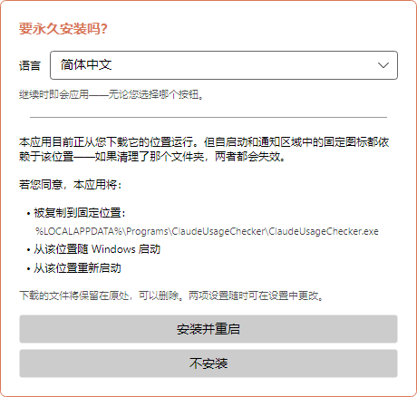
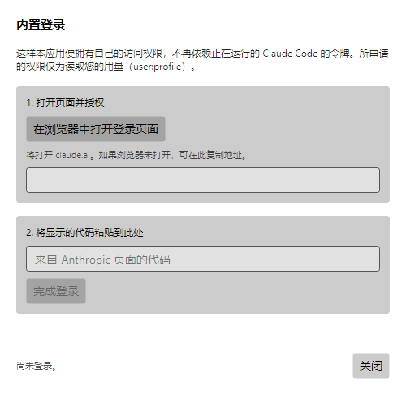
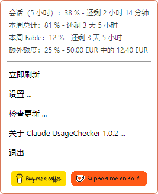
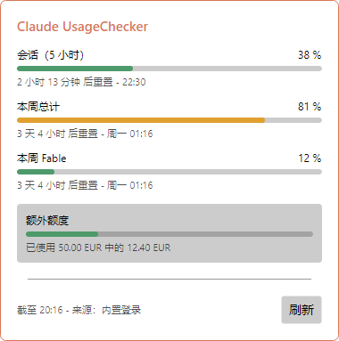
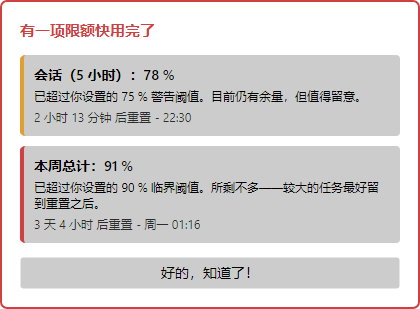
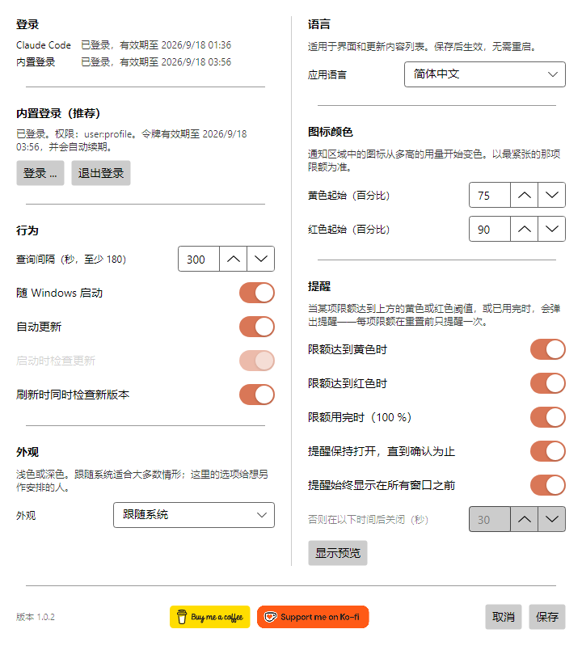
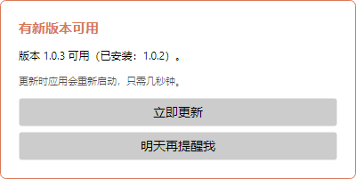
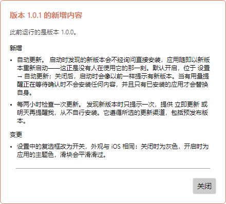
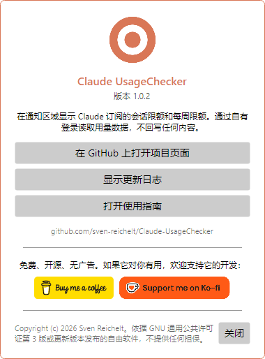

# Claude UsageChecker – 使用指南

[English](en.md) · [Deutsch](de.md) · [Español](es.md) · [Français](fr.md) · [Italiano](it.md) · [Português (Brasil)](pt-BR.md) · [Português (Portugal)](pt-PT.md) · [Русский](ru.md) · **简体中文**

Claude UsageChecker 会在 Windows 的通知区域或 macOS 的菜单栏中长期显示你的 Claude
订阅用量：五小时会话限额和每周限额。本指南逐个窗口介绍应用的全部功能。

截图取自 Windows。在 macOS 上窗口完全相同，只有菜单栏中的菜单由系统绘制。

## 目录

1. [安装](#1-安装)
2. [首次启动](#2-首次启动)
3. [登录](#3-登录)
4. [图标](#4-图标)
5. [菜单](#5-菜单)
6. [详情窗口](#6-详情窗口)
7. [提醒](#7-提醒)
8. [设置](#8-设置)
9. [更新](#9-更新)
10. [关于与支持项目](#10-关于与支持项目)
11. [卸载](#11-卸载)
12. [遇到问题时](#12-遇到问题时)

## 1. 安装

请从[发布页面](https://github.com/sven-reichelt/Claude-UsageChecker/releases/latest)下载最新版本。除此之外什么都不需要——既不用 .NET 运行时，也没有安装程序。

**Windows 10 或 11：** 下载 `ClaudeUsageChecker.exe` 并运行。由于文件未签名，第一次运行时
Windows SmartScreen 会提示发布者未知。点击 **更多信息**，再点击 **仍要运行**。

**macOS 12 或更高版本，Apple 芯片：** 下载 `ClaudeUsageChecker-macos-arm64.dmg`，打开后双击其中的应用。macOS
会询问一次是否打开从互联网下载的应用，点击 **打开**。请不要使用 `.zip`，它只用于应用的自我更新。

## 2. 首次启动

首次启动时，应用会提议把自己安装到固定位置：

* 在 **Windows** 上复制到 `%LOCALAPPDATA%\Programs\ClaudeUsageChecker`，从那里随 Windows
  启动，并重新启动；
* 在 **macOS** 上移动到「应用程序」文件夹，从那里在登录时启动，重新启动，并弹出磁盘映像。

请先在上方选择**语言**：窗口会立即切换，并且无论你按哪个按钮，选择都会保留。推荐选择
**安装并重启**：开机自启和自我更新只有从固定位置才能工作。**不安装**会让一切保持原样；开机自启稍后也可以在设置中打开。

## 3. 登录

应用需要读取用量的权限。有两条途径，它会都尝试：

* **应用自己的登录（推荐）。** 不依赖 Claude Code，并且会自行保持有效。
* **Claude Code 的令牌。** 如果同一台电脑上安装并登录了 Claude Code，应用会读取它的令牌——只读，绝不写回任何内容。

登录方式：打开**设置**，点击 **登录 …**：

1. 点击 **在浏览器中打开登录页面**，claude.ai 会打开，在那里授予访问权限。
2. 页面会显示一个代码。复制它，粘贴到输入框中，然后点击 **完成登录**。

所申请的权限只有读取你的用量（`user:profile`）——不包括以你的名义发送请求，也不包括创建 API
密钥。登录信息会加密保存在 Windows 凭据管理器或 macOS 钥匙串中。

## 4. 图标

通知区域或菜单栏中的图标一眼就能看出用掉了多少。以最紧张的那项限额为准：

| 图标 | 含义 |
| --- | --- |
|  | 一切都在范围内 |
|  | 某项限额达到了黄色阈值（默认 75 %） |
|  | 某项限额达到了红色阈值（默认 90 %） |
|  | 未登录，或没有网络连接 |

在 **Windows** 上，把指针停在图标上会显示会话和每周限额及其重置时间。左键点击打开[详情窗口](#6-详情窗口)，右键点击打开[菜单](#5-菜单)。

> **Windows 小提示：** 新图标会被放进小箭头后面的溢出区域。把图标拖到任务栏上，它就会一直可见。

在 **macOS** 上，点击图标即可打开菜单。

## 5. 菜单

菜单上方列出你的订阅所报告的**全部限额**，以及距离重置还剩多少时间——包括按模型划分的每周限额，以及已启用的额外额度。下方是：

* **立即刷新**——马上获取数值，而不必等待下一次查询。
* **设置 …**——见[设置](#8-设置)。
* **检查更新 …**——立即查找新版本。
* **关于 Claude UsageChecker …**——显示版本、更新日志和本指南。
* **退出**——结束应用。

在 macOS 上，菜单中还有 **显示详情 …**，两个支持按钮则显示为文字菜单项。

## 6. 详情窗口

每项限额都带有进度条、百分比、剩余时间和重置时刻：

* **会话（5 小时）**——滚动的五小时限额。
* **本周总计**——涵盖所有模型的七天限额。
* **本周** 加模型名称——某个模型的限额。只有当该模型在本周使用过之后才会出现。
* **额外额度**——每月上限中已花费的金额，使用你账户的货币，前提是额外额度已启用。

进度条的颜色来自你设置的阈值：低于黄色时为绿色，然后是黄色，再是红色。底部写明数值的获取时间和访问权限的来源。**刷新**会重新获取。点击别处或按
Esc 键即可关闭窗口。

## 7. 提醒

图标容易被忽略，因此当某项限额达到**黄色**、**红色**或 **100 %** 时会弹出提醒。它会说明是哪项限额、用到了多少、这意味着什么，以及何时重置。

* 每个级别对每项限额**只提醒一次**，直到该限额重置——并且重启后依然记得。
* 多项限额同时触发时共用一个提醒。
* 默认情况下提醒会一直显示在最前，直到你点击 **好的，知道了！**。
* 它不会抢走键盘：你正在输入的内容不受影响。
* 关于已经重置的限额的提醒会自动关闭。

它有多执着，由你在[设置](#提醒)中决定。

## 8. 设置

点击**保存**后更改才生效；**取消**会放弃更改。

### 登录

最上方显示：这台电脑上的 Claude Code 是否已登录，以及应用自己的登录是否可用——无论当前使用哪一种，两者始终都会显示。下面是用于内置登录的
**登录 …** 和 **退出登录**。

### 行为

* **查询间隔**——多久获取一次数值，单位为秒。至少 180：服务会限制更快的频率。
* **随 Windows 启动** / **登录时启动**——在你登录电脑时启动应用。如果该启动项丢失，应用会在下次启动时重新写入。
* **自动更新**——启动时不经询问直接安装新版本。见[更新](#9-更新)。
* **启动时检查更新**——仅在自动更新关闭时可用：此时启动会提示有新版本。
* **刷新时同时检查新版本**——详情窗口中的**刷新**按钮也会顺带查找更新。

### 外观

浅色、深色，或跟随系统。选择时窗口立即改变，保存前就能看到效果。

### 语言

整个应用的语言，包括更新后的新增内容列表。保存即生效，无需重启。

### 图标颜色

图标、进度条和提醒从多高的用量开始变**黄**、变**红**。黄色必须低于红色。

### 提醒

* 哪些级别会发出提醒：**黄色**、**红色**、**已用完（100 %）**。
* **提醒保持打开，直到确认为止**——否则它会在下方设定的秒数后自动关闭。
* **提醒始终显示在所有窗口之前**。
* **显示预览**——用示例数据展示提醒，让你看清上面的选项分别有什么效果。

窗口底部是版本号和[支持按钮](#10-关于与支持项目)。

## 9. 更新

应用会自行保持最新。每次下载都会先与公布的 SHA-256 校验和比对，之后才会运行任何内容；在 macOS 上还会额外校验签名。

**自动更新开启时**（默认），启动时发现的新版本会不经询问直接安装。应用会在几秒内以新版本重新启动，并显示新增内容。

**自动更新关闭时**，启动会提示有新版本，安装仍然是点击 **立即安装并重启**。

**两种情况下**，应用都会每两小时在后台检查一次。发现新版本时，它只询问**一次**：

* **立即更新**——安装并重启。
* **明天再提醒我**——24 小时后再次询问。如果期间重启了电脑，在自动更新开启的情况下，更新会在启动时安装。

只要还有用量提醒在等待确认，就不会安装任何内容。

更新之后，应用会显示自你先前的版本以来有哪些变化——如果你跳过了若干版本，也会一并列出。

## 10. 关于与支持项目

菜单中的 **关于 Claude UsageChecker** 显示版本，并可前往项目页面、完整更新日志和本指南。

Claude UsageChecker 免费、开源、无广告。如果它对你有用，**Buy me a coffee** 和 **Support me on
Ko-fi** 按钮——在这里、在菜单中以及设置窗口底部——会带你到可以支持其开发的页面。点击只会在浏览器中打开页面。

## 11. 卸载

**Windows**

1. 右键点击图标，选择**退出**。
2. 若想干净地移除开机自启，请先打开设置，关闭 **随 Windows 启动** 并保存；或者删除
   `HKEY_CURRENT_USER\Software\Microsoft\Windows\CurrentVersion\Run` 下的
   `ClaudeUsageChecker` 值。
3. 删除文件夹 `%LOCALAPPDATA%\Programs\ClaudeUsageChecker`（应用本体）和
   `%LOCALAPPDATA%\ClaudeUsageChecker`（设置）。
4. 在 Windows 凭据管理器中删除以 `ClaudeUsageChecker:` 开头的条目。

**macOS**

1. 在菜单中选择**退出**。
2. 删除 `/Applications/ClaudeUsageChecker.app`、
   `~/Library/Application Support/ClaudeUsageChecker` 和
   `~/Library/LaunchAgents/de.sven-reichelt.claudeusagechecker.plist`。
3. 在「钥匙串访问」中删除以 `ClaudeUsageChecker:` 开头的条目。

完整的存储位置清单见
[SECURITY.md](../../SECURITY.md#2a-what-the-application-stores-where---in-full)。

## 12. 遇到问题时

**图标一直是灰色的。** 应用没有访问权限。打开设置：两种登录中至少要有一种显示*已登录*。如果没有，请重新登录。

**「你的登录已过期」。** 登录在闲置多久后失效，Anthropic 没有公开说明。请在 **设置 → 登录 …**
中重新登录；在此之前会使用 Claude Code 的令牌（如果有）。

**没有数值，提示「API 正在限流」。** 服务会限制查询频率。应用会自行等待并重试；把查询间隔调得更短只会更糟，而不会更好。

**提醒没有出现。** 每个级别对每项限额只提醒一次，直到该限额重置。请在 **设置 → 提醒**
中确认该级别已开启，并试试**显示预览**。

**Windows 警告发布者未知。** 这是预期内的：文件没有签名。**更多信息 → 仍要运行**。

**macOS 拒绝打开应用。** 请使用 `.dmg`，不要用 `.zip`。如果拒绝出现在新版本刚发布之后，请稍后再试。

**其他问题。** 应用会在设置旁边写入 `crash.log`：Windows 上位于
`%LOCALAPPDATA%\ClaudeUsageChecker\crash.log`，macOS 上位于
`~/Library/Application Support/ClaudeUsageChecker/crash.log`。其中不含任何令牌。请
[报告问题](https://github.com/sven-reichelt/Claude-UsageChecker/issues/new/choose)并附上该文件——但绝不要粘贴访问令牌。
